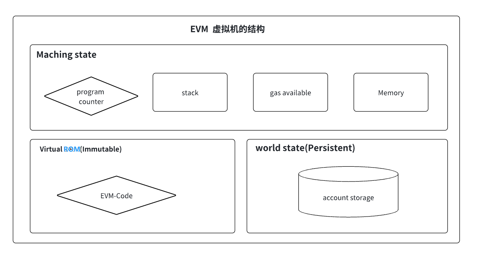

### 图示记忆
- 

### EVM 的结构可以看作一个分层的计算模型，每个部分有明确的分工：
- ```MachineState``` 是运行时的“动态大脑”，负责指令的即时执行和数据处理（栈、内存、PC、Gas）。
- ```Virtual ROM(Read-Only Memory)``` 是“静态蓝图”，提供不可变的指令序列，定义合约逻辑。
- ```WorldState``` 是“持久记忆”，保存区块链的全局状态，确保数据在交易间延续。

### EVM作为机器人的比喻：
- ```MachineState``` 是机器人的“工作台”，包括它的计算工具（栈）、临时笔记（内存）、燃料表（Gas）和指令指针（PC）。
- ```Virtual ROM``` 是机器人的“操作手册”，不可更改，告诉它如何工作。
- ```WorldState``` 是机器人的“档案库”，记录所有历史数据和状态，供未来参考。

---------------------------------------------------------------------------------------------------------

### ```MachineState```详细说明：
- 概念：表示 EVM 在执行智能合约时的瞬时状态。（程序计数器、栈、可用Gas、内存）
- 理解：EVM 的“运行时快照”，记录了当前指令执行的上下文（位置、数据、资源）。它完全动态，每次执行都会重置，确保 EVM 的每次运行是独立的、确定的。
- 核心组件如下：
```
    ProgramCounter（程序计数器，PC）：
        作用：记录当前执行的字节码指令位置，类似于 CPU 中的指令指针。
        理解：它就像一个“书签”，告诉 EVM 接下来要执行哪条指令（字节码中的偏移量）。
            每次执行完一条指令，PC 通常递增，除非遇到跳转指令（JUMP 或 JUMPI）。
        特点：PC 是动态的，执行过程中不断更新。
        
    Stack（栈）：
        作用：基于后进先出（LIFO）的内存结构，用于存储操作数和中间计算结果。
        理解：栈是 EVM 的“计算核心”，所有算术、逻辑、比较等操作都在栈上完成。
            例如，ADD 操作会从栈顶弹出两个值，相加后将结果压回栈顶。栈最大深度为 1024 项（每项 256 位）。
        特点：栈是临时的，合约执行结束后清空，且操作栈的 Gas 成本较低。
        
    GasAvailable（可用 Gas）：
        作用：跟踪当前交易或调用剩余的 Gas，用于限制计算资源消耗。
        理解：Gas 是 EVM 的“燃料”，每条指令都会消耗一定量的 Gas。如果 Gas 耗尽，执行会中止并回滚（抛出 Out-of-Gas 异常）。
            它确保 EVM 的计算是可控的，防止无限循环或恶意合约。
        特点：GasAvailable 贯穿整个执行过程，限制计算资源，防止滥用，在执行过程中递减，动态更新。
        
    Memory（内存）：
        作用：提供临时、可写的线性存储区域，用于存储合约运行时的中间数据（如数组、字符串等）。
        理解：内存就像一块“便签纸”，合约可以在执行时读写数据，但执行结束后内存会被清空。
            内存按字节寻址，扩展时会按需分配（但扩展内存会增加 Gas 成本）。
        特点：内存是易失性的，Gas 成本与内存使用量相关。                                    
```

### ```Virtual ROM(Read-Only Memory，虚拟只读存储)```详细说明：
- 作用：用于存储智能合约编译后的不可变字节码（Bytecode），是 EVM 执行的指令序列。
- 理解：相当于 EVM 的“程序存储区”，类似于传统计算机中的 ROM（只读存储器）。
- 特点如下：
```
    独立性：
        该存储区，保存了每一个合约的逻辑（即编译后的操作码序列，如 PUSH1、ADD、CALL 等）。
        
    不可变性：
        合约编译后的不可变字节码，一旦合约部署到区块链上，其代码就固定，无法修改。这保证了合约行为的确定性和可信性。
        
    Gas 成本：
        通过程序计数器（PC）逐条读取和执行字节码，结合栈、内存等完成计算，得出每条指令都会消耗特定 Gas，由操作码定义。
```

### ```WorldState(世界状态)```
- 作用：是全局状态，记录所有账户的状态，包括账户存储（Account Storage）。
- 理解：相当于一个键值数据库，键是账户地址，值是账户的状态（包括余额、Nonce、代码哈希、存储根等）。
- 其他如下：
```
    Account Storage（账户存储）：
        指的合约账户(Contract Account)，存储是一个持久化的键值映射（key-value mapping），用于保存合约的状态变量（如代币余额、用户数据等）。
        它与内存不同，数据在交易执行后会永久保存。
        [ 外部账户（Externally Owned Account）无独立存储空间，仅存储余额（balance）和交易计数器（nonce）]
    
    WorldState 是整个以太坊网络的"账本"：
        所有节点必须保持一致。每次交易都会更新 WorldState（例如，修改某个合约的存储值），并通过默克尔树（Merkle Trie）结构确保高效验证和一致性。
        该"账本"存储在以太坊的"状态树"中。    
```