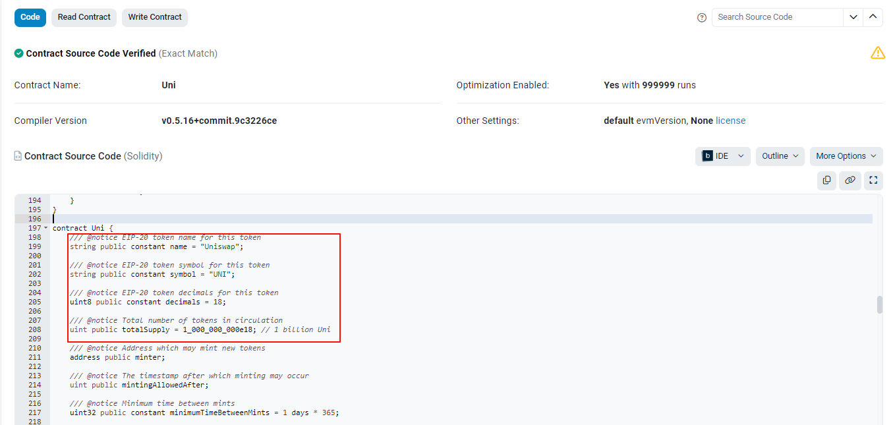
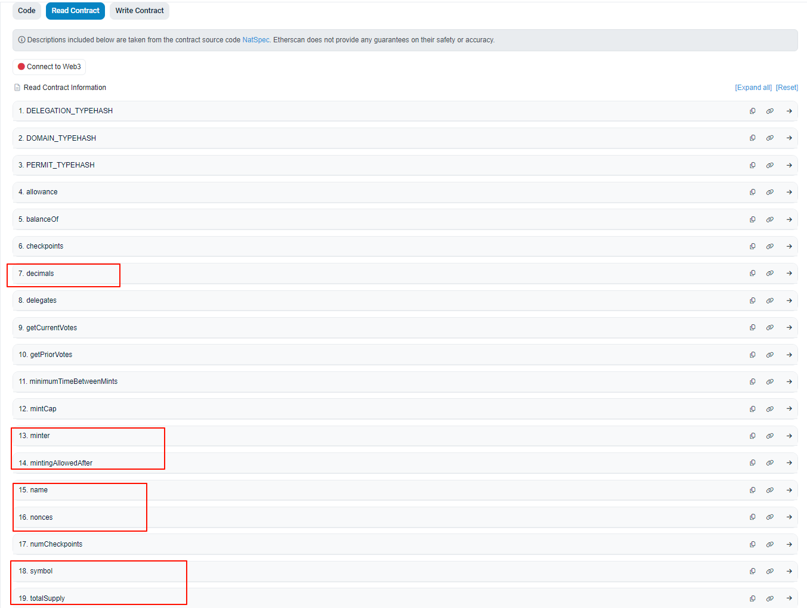

#### 值类型（Value Types）完全统计：
- 布尔型（bool）
- 整数型（int 和 uint）
- 地址型（address）（20 字节）
- 固定长度数组（Fixed-size Arrays）
- 定长字节型（bytes1 到 bytes32）（1个字节 到 32个字节）
- 枚举型（enum）（起始值 0）

　

#### 引用类型（Reference Types）完全统计：
- 动态大小的字节数组（bytes）
- 字符串（string）
- 动态长度数组（Dynamic-size Arrays）
- 结构体（struct）
- 合约（contract）

　

#### 映射类型（Mapping Types）完全统计：
- 哈希表（mapping），就此一家，虽然它是一只特殊的引用类型

　

#### constant说明(统称：常量)：
- 在编译时必须赋值(即，声明的时候)
- 读取时，几乎不消耗 gas
- 适用：如数学常量、固定的配置值等

　

#### immutable说明(统称：不变量)：
- 在编译时必须赋值(即，声明的时候)，在合约部署时赋值(即，构造函数)；必须是二者取其一!
- 读取时，消耗 gas
- 适用：如合约的初始化参数、合约的部署地址等

　


　

#### 整数类型细说：
- 不论uint或者int【8位 ~ 256位】【使用字节对齐的方式位数值是8/16/24/32/40/48/56/64/72/80/88/96...........256】【粗暴理解为8的倍数值】
- 占位字节数【1 ~ 32】

　

#### uint8
- 取值范例【0 ~ 1111 1111】
- 取值【0 ~ 2^Bit -1】
- 如【0 ~ 2^8 -1】即【0 ~ 255】

　

#### int8 (建议复习一下计算机的补码原理)
- 取值范例【1111 1111 , 0111 1111】
- 取值【-1*(2^(Bit-1)) ~ 2^(Bit-1) -1】
- 如【-1*(2^7) ~ 2^7 -1】即【-128 ~ 127】

　

#### 地址类型细说：
- 20个字节(160位，二进制位)
- 1个字节 = 由8位（Bits）组成，也就是[2^8-1 = 255]，即从0到255的值。
- 1个字节 = 2个十六进制数(两个十六进制数，FF => 255)
- 1个字节 = 3个十进制数(两个十进制数，99 => 99，不足以表达255；3个十进制数，999 => 999 足以表达)
- 1个字节 = 3个八进制数(两个八进制数，77 => 63，不足以表达255；3个十进制数，777 => 511 足以表达)
- 如，```0x1234567890123456789012345678901234567890```，十六进制表达方式，即40个值
- 获取合约的地址，如，合约实例为 ```TargetContract target```，那么，它的地址为 ```address(target)```

　

#### 定长字节型细说：
- 32个字节
- 十六进制表达方式，即40个值
- ```bytes32 public _byte32 = "MiniSolidity";```
- "MiniSolidity"的长度是11个字符。每个字符在UTF-8编码中占用1个字节，所以总长度是11字节。
- ```"MiniSolidity" + 21个零字节```
- ```0x4d696e69536f6c69646974790000000000000000000000000000000000000000```

　

#### 枚举类型细说：
- 底层类型是 uint（无符号整数），不能显性的赋值，默认从0开始。
- 如果枚举的成员数量在256个以内，则底层类型为uint8
- 如果枚举的成员数量超过256个，则底层类型为uint256(即，uint)
- 如果把枚举当作返回值，则类型填枚举名(否则，编译错误)
- 枚举定义中，切记最后一个值的末尾不能携带"逗号"，必须为空(否则，编译错误)
- 枚举定义中，末尾的梅花括号不能携带"分号"，必须为空(否则，编译错误)
```
    enum Status {
        InIdle,          // 0
        InProgress,      // 1
        InPause,         // 2
        InEnd            // 3
    }

    function getStatus() public view returns (Status) {
        return Status.InEnd;
    }
```    

　

------------------------------------------------------------------------------------------------------------------------------------------

　

#### 动态大小的字节数组细说：
- bytes是一个更通用的动态字节数组，可以存储任意字节数据。
- ```bytes dynamicBytes = "Hello, Solidity!";```

　

#### 字符串细说：
- string是bytes的一个子类型
- string 是一种动态长度的 Unicode(UTF-8编码) 字符串，用于存储文本数据。
- string 是 bytes 的一个特殊形式，专门用于处理文本。
- ```string message = "Hello, Solidity!";```

　

#### 数组类型细说：
```
uint[3] fixedSizeArray = [1, 2, 3];
uint[] dynamicArray; 
dynamicArray.push(1); 
dynamicArray.push(2); 
dynamicArray.push(3);
```

　

#### 映射（mapping）类型细说：
- 必须存储在storage中
- 不储存任何键（Key）的资讯，也没有length的资讯，故，不支持迭代或获取键的集合，只能通过键快速访问值
- 主键只能是值类型（如 uint、address 等），而值可以是任意类型，包括引用类型。
- 访问mapping的时候，如果"目标主键"不存在，则返回"值"的默认value。不会报错。
- 使用delete操作符，会把映射值重置为默认值。如，```delete balances[msg.sender];```

　

------------------------------------------------------------------------------------------------------------------------------------------

　

#### 函数形式：
```
function <function name>(<parameter types>) {internal|external|public|private} [pure|view|payable] [returns (<return types>)]
```

　

#### 函数可见性：
- public：内部和外部均可见。
- 当一个状态变量被声明为public时，编译器会自动生成一个同名的getter函数，这一定非常常见(在区块链浏览器，随便找一个知名合约，查看试试)。


- 与其他传统编程语言不同的是，合约声明了public变量，外界也无非直接对它进行修改。
```
// 声明一个mapping
mapping(address => mapping(address => address)) public getPair;

// 等价于同名的getter函数，如下:
function getPair(address tokenA, address tokenB) external view returns (address pair);
```
- private：只能从本合约内部访问，继承的合约也不能使用。
- external：只能从合约外部访问（但内部可以通过 ```this.f()``` 来调用，f是函数名，但这种调用方式消耗gas较多，不推荐）。
- internal: 只能从合约内部访问，继承的合约可以用。

　

#### 函数权限(功能关键字)：
- payable：可支付(必须是以太币)
- pure：纯净(不读不写)
- view：纯读，读取链上数据，在本地节点(当前连接的节点)上执行，无需广播到整个网络或由矿工验证，因此不需要支付 Gas 费用。
* 注意，使用emit 事件，也认定为修改了合约状态，即最少使用view，而不是pure
* 注意，address.call/delegatecall，也认定为可能修改了合约状态，即最少使用view，而不是pure
- 空：(没支付、有写操作)

　

#### 变量的存储位置(顺带介绍)：
- storage：存储在链上(持久性存储，不会销毁)
- memory：存储在合约内存中(临时的、可变的内存区域，用于存储在函数调用过程中创建的变量和数据结构，函数调用完毕则生命周期结束)
- calldata：同memory，存储在的合约内存中(一般修饰external函数的参数，但不可更改它)
- 堆栈：函数的调用栈(声明周期，随着函数调用开始，函数调用完成则结束)

　

#### 存储位置细说 - 变量作为代码声明的时候(即，合约的状态变量)：
- 不论值类型还是引用类型：修饰符必须为空，存储在链上
- 映射类型：修饰符必须为空，存储在链上

　

#### 存储位置细说 - 变量作为函数参数的时候：
- 引用类型：要么memory，要么calldata(当external)
- 值类型：修饰符必须为空，存储在堆栈中
- 映射类型：禁止

　

#### 存储位置细说 - 变量作为函数体内的局部变量的时候：
- 引用类型：memory
- 值类型：修饰符必须为空，存储在堆栈中
- 映射类型：禁止

　

#### 函数形式示例：
```
    function foo() public {
        //Nothing
    }

    function foo() public pure {
        //Nothing
    }

    function foo() public pure returns(uint) {
        return 1;
    }

    function foo() public pure returns(uint ret) {
        ret = 1;
    }

    function foo() public pure returns(uint ret) {
        return  1;
    }    
```    

　

#### 函数体内，创建结构体struct
```
Person memory newPerson = new Person({...});    是过时的语法，Solidity 0.8.x以前的版本使用
Person memory newPerson = Person({...});        是推荐的语法，Solidity 0.8.x以及之后的版本使用
Person memory newPerson = Person(...);          是推荐的语法，Solidity 0.8.x以及之后的版本使用
```

　

#### 固定长度数组的声明(同时初始化，可选)：
```
uint[8] array0;
uint[3] array1 = [uint(1), 2, 3];   //如果不强转1，可能会编译不通过(编译器默认会把1识别int256)
bytes1[5] array2;
address[100] array3;
```

　

#### 动态长度数组的声明(不可能同时初始化)：
```
uint[] array4;
bytes1[] array5;
address[] array6;
bytes array7;                       //bytes比较特殊，是数组，但是不用加[]
```

　

#### 数组的成员(变量，以及函数)
```
length            //长度
push(x)           //动态数组尾部添加元素
pop()             //动态数组末尾移除最后一个元素，并返回该元素
delete ary[index] //把指定元素重置为默认值
delete ary        //动态长度数组，把指定元素重置为默认值，数组长度变为0
delete ary        //固定长度数组，把指定元素重置为默认值，数组长度不变化
```