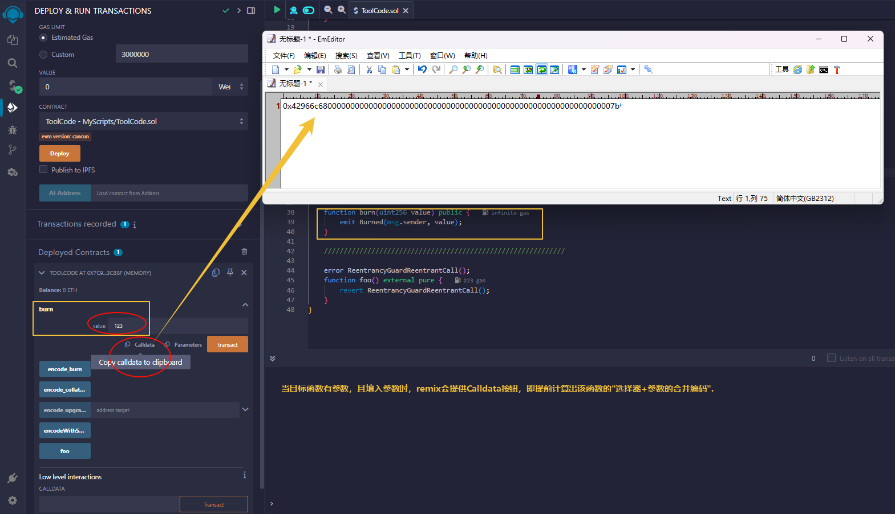
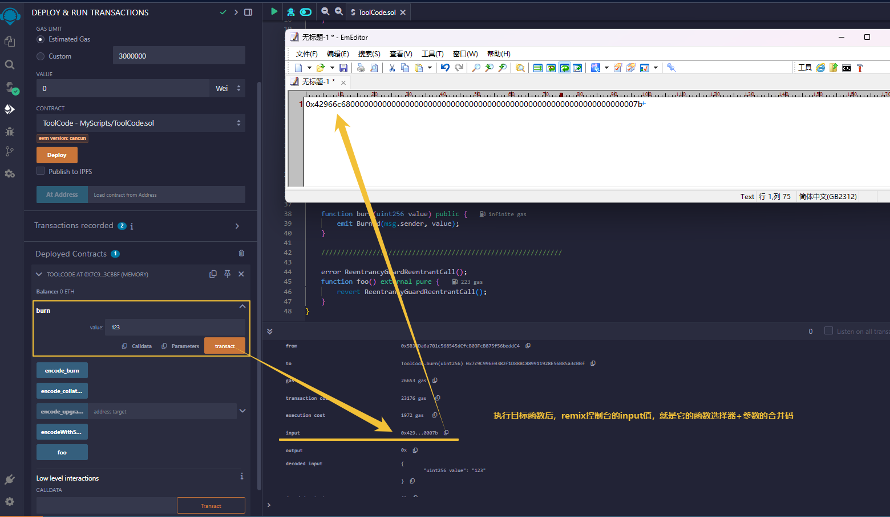

#### 函数选择器概念：
- 当我们调用智能合约的普通函数时，本质上是向目标合约发送了一段calldata。
- calldata，就是remix控制台打印中的input"。


- 它的前4个字节，就是函数选择器```selector```，也可以叫做```method id```
- 它懂得后32字节为"参数"。

　

#### 函数签名的概念：
- 用于唯一标识一个函数的字符串，通常由函数的名称和参数类型构成。
- 不包含：function前缀、函数的功能关键字、函数的访问限制符、函数返回值
- ```functionName(type1,type2,...)```

　

---------------------------------------------------------------------

　

#### 计算"函数选择器"的公式：
```
bytes4 data = bytes4(keccak256("functionName(paramType1,paramType2...)"))
```

　

#### 计算示例(携带基础类型参数)：
```
bytes4 data = bytes4(keccak256("functionName(uint256,bool)"))
```

　

#### 计算示例(携带固定长度类型参数)：
```
bytes4 data = bytes4(keccak256("functionName(uint256[3])"))
```

　

#### 计算示例(携带可变长度类型参数)：
```
bytes4 data = bytes4(keccak256("functionName(uint256[],string)"))
```

　

#### 计算示例(携带映射类型参数：(地址类型，struct类型，枚举类型))：
```
bytes4 data = bytes4(keccak256("functionName(address,(uint256,bytes),uint8)"))
```

　

#### 注意：在目标函数没有发生重载的情况下，完全等价于以下：
```
bytes4 data = this.functionName.selector;
```

　

--------------------------------------------------------------------------------------

　

#### 其他：
- 使用selector进行调用目标合约的函数(详见：016 abi编码相关.md)

#### 三种方式如下：
```
// 使用[函数签名]和[参数编码数据]，调用目标函数
bytes memory data = abi.encodeWithSignature("doSomething(uint256,bool)",123,true);
(bool success1, bytes memory data1) = address(targetContract).call(data);
```
```
// 使用[函数选择器]和[参数编码数据]，调用目标函数
bytes4 memory data = this.functionName.selector;
(bool success1, bytes memory data1) = address(targetContract).call(abi.encodeWithSelector(data, 123, true));
```
```
// 使用[函数选择器]和[参数编码数据]，调用目标函数
bytes4 memory data = bytes4(keccak256("doSomething(uint256,bool)"))
(bool success1, bytes memory data1) = address(targetContract).call(abi.encodeWithSelector(data, 123, true));
```

#### 函数选择器冲突：
- 函数选择器冲突：指的是一个合约中，存在两个或以上的函数，具备相同的函数选择器。
- 举例子：两个函数的名称与参数完全一致，但返回值不一致。那么，它们也算作是冲突！
```
contract Example {
    function getNumber() public pure returns (uint256) {
        return 42;
    }

    function getNumber() public pure returns (int256) {
        return 42;
    }
}
```

#### 接口的 interfaceId
- 一个接口中，把所有函数的函数选择器进行编码后得到的bytes4。
- 过程大概如下：
```
bytes4 interfaceId = bytes4(keccak256(abi.encodePacked(
    bytes4(keccak256(bytes(signature1))),
    bytes4(keccak256(bytes(signature2))),
    // ...
    bytes4(keccak256(bytes(signatureN)))
)));

// 其中 signature1, signature2, …, signatureN 是接口中每个函数的签名，按照字典顺序排列。
```
　

#### 编程范例
- 详见(contract/TestFunctionSelector.sol)