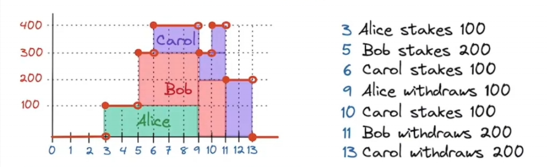

#### 概念
- 质押：用户将一定数量的加密货币锁定在区块链网络中，以支持网络的安全性和运行。质押者通过提供自己的资产帮助验证交易和生成新块。
- 奖励：用户在质押的过程中，通常系统会奖励给用户一定数量的加密货币，奖励的数量可能与质押的资产数量、质押的时间长度以及网络的具体机制有关。
- 激励机制：系统激励用户持有和质押其资产，而不是在市场上交易。这种机制帮助维护网络的安全性和稳定性，同时提高了质押者的长期参与感。
- 风险与收益：质押虽然可以带来收益，但也伴随着风险，例如资产价格波动、质押锁定期（某些网络在质押期间无法赎回资产）以及网络的安全性等问题。
- 动态性：普通的质押奖励是一种激励用户参与和支持区块链网络的机制，用户通过质押资产可以获得额外的收益。这种方式不仅促进了区块链的安全性和去中心化，还鼓励长期持有和参与。

　

---------------------------------------------------------------------------------------------------------

　

#### 数学过程推演：
- 由于推演的数学符号包含坐标轴，故这里不再使用markdown的数学语法进行表述，而使用贴图。
- 以下将讨论普通意义上的"质押奖励"过程(即"奖励率"是相对恒定的)。

　

##### 基本坐标轴图示
- 横轴X，表示时间轴(颗粒度为秒)
- 纵轴Y，表示质押代币数量
- 第3秒，Alice质押了100个代币
- 第5秒，Bob质押了200个代币
- 第6秒，Carol质押了100个代币
- 第9秒，Alice取走了100个代币
- 第10秒，Carol质押了100个代币
- 第11秒，Bob取走了200个代币
- 第13秒，Carol取走了200个代币

　

##### 如何表达Alice，在这整个过程中获取的奖励
- Alice从第3秒到第9秒，总共获取的奖励
- 也就是，中间每一秒钟获取的奖励之和(3->4，4->5，5->6，6->7，7->8，8->9)。
- 以下介绍几个关键变量：
- $S_i$：在第i秒时，目标用户质押的总数量
- $T_i$：在第i秒时，系统中所有用户质押的总数量
- $R_i$：系统每一秒钟产出的奖励数量，即，"奖励率"，是恒定的。
- Alice在第3->4秒中，获取的奖励值 = $\frac{S_3}{T_3}·R$
- 所以，Alice总共获取的奖励为 $r(A,3,9) = \frac{S_3}{T_3}·R + \frac{S_4}{T_4}·R + \frac{S_5}{T_5}·R + \frac{S_6}{T_6}·R + \frac{S_7}{T_7}·R + \frac{S_8}{T_8}·R$
- 总结 $r(user,k,n) = \frac{S_k}{T_k}·R + \frac{S_(k+1)}{T_(k+1))}·R + ... \frac{S_(n-1)}{T_(n-1)}·R = \sum_{i=k}^{(n-1)} \frac{S_i}{T_i}·R$

　

- 以上公式，只是初步计算，很明显推导到这里，并未结束
- 我们发现，在Alice的时间轴上， 第5秒，第6秒，第9秒，这三个临界点上，系统的总质押量都有变化。所以，需要继续细化公式。
- 在公式层面，越恒定的值，越容易被提炼出。
- 找出Alice时间轴上，恒定的部分，加以拆分：[第3秒 -> 第5秒]，[第5秒 -> 第6秒]，[第6秒 -> 第9秒]
- 也就是 $\sum_{i=3}^{(5-1)} \frac{S_3}{T_i}·R ， \sum_{i=5}^{(6-1)} \frac{S_5}{T_i}·R ， \sum_{i=6}^{(9-1)} \frac{S_6}{T_i}·R$
- 我们把以上3段中的任何1段，每1段过程中Alice的质押量保持恒定，想象成一个新的通用的过程。
- 如，[第3秒 -> 第5秒]的奖励值：$r(A,3,5) = r(A,k,n) = \sum_{i=k}^{(n-1) \frac{S_i}{T_i}·R} = S·\sum_{i=k}^{(n-1) \frac{R}{T_i}$
