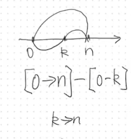
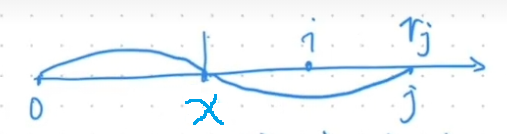
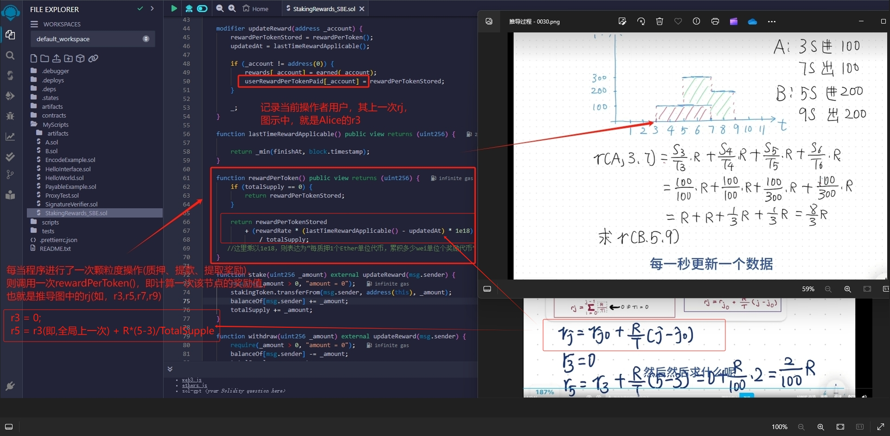
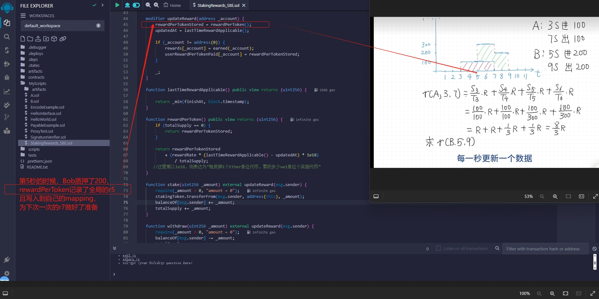
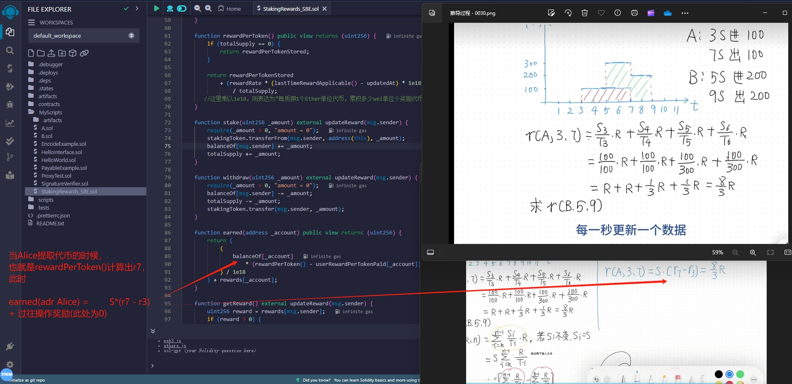

#### 概念
- 质押：用户将一定数量的加密货币锁定在区块链网络中，以支持网络的安全性和运行。质押者通过提供自己的资产帮助验证交易和生成新块。
- 奖励：用户在质押的过程中，通常系统会奖励给用户一定数量的加密货币，奖励的数量可能与质押的资产数量、质押的时间长度以及网络的具体机制有关。
- 激励机制：系统激励用户持有和质押其资产，而不是在市场上交易。这种机制帮助维护网络的安全性和稳定性，同时提高了质押者的长期参与感。
- 风险与收益：质押虽然可以带来收益，但也伴随着风险，例如资产价格波动、质押锁定期（某些网络在质押期间无法赎回资产）以及网络的安全性等问题。
- 动态性：普通的质押奖励是一种激励用户参与和支持区块链网络的机制，用户通过质押资产可以获得额外的收益。这种方式不仅促进了区块链的安全性和去中心化，还鼓励长期持有和参与。

　

---------------------------------------------------------------------------------------------------------

　

#### 数学过程推演：
- 由于推演的数学符号包含坐标轴，故这里不再使用markdown的数学语法进行表述，而使用贴图。
- 以下将讨论普通意义上的"质押奖励"过程(即"奖励率"是相对恒定的)。

　

##### 基本坐标轴图示
- 横轴X，表示时间轴(颗粒度为秒)
- 纵轴Y，表示质押代币数量
- 第3秒，Alice质押了100个代币
- 第5秒，Bob质押了200个代币
- 第6秒，Carol质押了100个代币
- 第9秒，Alice取走了100个代币
- 第10秒，Carol质押了100个代币
- 第11秒，Bob取走了200个代币
- 第13秒，Carol取走了200个代币


　

##### 如何表达Alice，在这整个过程中获取的奖励
- Alice从第3秒到第9秒，总共获取的奖励
- 也就是，中间每一秒钟获取的奖励之和(3->4，4->5，5->6，6->7，7->8，8->9)。
- 以下介绍几个关键变量：
- $S_i$：在第i秒时，目标用户质押的总数量
- $T_i$：在第i秒时，系统中所有用户质押的总数量
- $R_i$：系统每一秒钟产出的奖励数量，即，"奖励率"=($\frac{管理员分配的奖励代币数量}{质押活动的总时长(秒)}$)，是恒定的。
- Alice在第3->4秒中，获取的奖励值 = $\frac{S_3}{T_3}·R$
- 所以，Alice总共获取的奖励为 $r(A,3,9) = \frac{S_3}{T_3}·R + \frac{S_4}{T_4}·R + \frac{S_5}{T_5}·R + \frac{S_6}{T_6}·R + \frac{S_7}{T_7}·R + \frac{S_8}{T_8}·R$
- 总结 $r(user,k,n) = \frac{S_k}{T_k}·R + \frac{S_(k+1)}{T_(k+1))}·R + ... \frac{S_(n-1)}{T_(n-1)}·R = \sum_{i=k}^{(n-1)} \frac{S_i}{T_i}·R$

　


- 以上公式，只是初步计算，很明显推导到这里，并未结束
- 我们发现，在Alice的时间轴上， 第5秒，第6秒，第9秒，这三个"临界点"上，系统的总质押量都有变化。所以，需要继续细化公式。
- 在公式层面，越恒定的值，越容易被提炼出。
- 找出Alice时间轴上，恒定的部分，加以拆分：[第3秒 -> 第5秒]，[第5秒 -> 第6秒]，[第6秒 -> 第9秒]
- 也就是 $\sum_{i=3}^{(5-1)} \frac{S_3}{T_i}·R ， \sum_{i=5}^{(6-1)} \frac{S_5}{T_i}·R ， \sum_{i=6}^{(9-1)} \frac{S_6}{T_i}·R$
- 我们把以上3段中的任何1段，每1段过程中Alice的质押量保持恒定，想象成一个新的通用的过程。



- 如，[第3秒 -> 第5秒]的奖励值 $r(A,3,5) = r(A,k,n) = \sum_{i=k}^{(n-1)} \frac{S_i}{T_i}·R = S·\sum_{i=k}^{(n-1)} \frac{R}{T_i} = S·(\sum_{i=0}^{(n-1)} \frac{R}{T_i} - \sum_{i=0}^{(k-1)} \frac{R}{T_i})$
- 如，[第5秒 -> 第6秒]的奖励值，同理 $r(A,5,6)$
- 如，[第6秒 -> 第9秒]的奖励值，同理 $r(A,6,9)$
- 总结 $r(A,k,n) = S·(\sum_{i=0}^{(n-1)} \frac{R}{T_i} - \sum_{i=0}^{(k-1)} \frac{R}{T_i}) => 简写 => S·(r_n - r_k)$，k到n的过程，代表目标用户质押的总数量保持恒定。
- [第3秒 -> 第5秒]的奖励值 $S·(r_5 - r_3)$
- [第5秒 -> 第6秒]的奖励值 $S·(r_6 - r_5)$
- [第6秒 -> 第9秒]的奖励值 $S·(r_9 - r_6)$

　

- 接下来，我们对 $"累计求和数列r_n"$，进行拆分。
- 为了不与上面推导公式中的n重合，我们定义为 $"累计求和数列r_j"$
- 此时，用户的质押量 $S_i$ 已经被抽离出去了，不恒定的变量只剩下为 $T_i$。
- $r_j = \sum_{i=0}^{(j-1)} \frac{R}{T_i}$，代表用户从第0秒，到第j秒，累积获得奖励。
- 我们需要设想 $T_i$为恒定值，故在第 $x$ 秒，到第 $j$ 秒 之间， $T_i = T$恒定不变。


- $r_j = \sum_{i=0}^{(j-1)} \frac{R}{T_i} = \frac{R}{T}·\sum_{i=0}^{(j-1)}·1 = r_x + \sum_{i=x}^{j-1}·\frac{R}{T}$
- $r_j = r_x + \frac{R}{T}·\sum_{i=x}^{j-1}·1$
- 终于到了"纯数值累加求和"
- $r_j = r_x + \frac{R}{T}·(j-1-x+1)$
- $r_j = r_x + \frac{R}{T}·(j-x)$

　

- 依据上面的公式，以此类推：
- $r3 = 0$
- $r5 = r3 + \frac{R}{T}·(5-3)$
- $r6 = r5 + \frac{R}{T}·(6-5)$
- $r9 = r6 + \frac{R}{T}·(9-6)$

　
-------------------------------------------------------------

　

- 至此，质押奖励的计算逻辑，已经完全确定。
- 一个用户的最终质押奖励值，一定是一个累加的过程，每次有"临界点(压入代币，取出代币，提取奖励)"的变动时，都需要有逻辑计算与存储。
- 牢记，每当时间轴到达"临界点"，则使用公式 $r_j = r_x + \frac{R}{T}·(j-x)$

　

- 以下是一份示例代码：
```
// SPDX-License-Identifier: MIT
pragma solidity ^0.8.24;

// 质押活动合约
//__________________ a轮开始, duration，a轮finishAt __________________ b轮开始, duration，b轮finishAt __________________ c轮开始, duration，c轮finishAt

contract StakingRewards {
    IERC20 public immutable stakingToken; // 质押代币
    IERC20 public immutable rewardsToken; // 奖励代币

    address public owner; // 合约所有者

    // 奖励支付的持续时间（以秒为单位）
    uint256 public duration; 
    // 奖励结束的时间戳
    uint256 public finishAt; 
    // 最后更新时间与奖励结束时间的最小值
    uint256 public updatedAt; 
    // 每秒支付的奖励数量
    uint256 public rewardRate; 
    // (reward rate * dt * 1e18 / total supply) 的总和
    uint256 public rewardPerTokenStored; 
    // 用户地址 => 奖励每个代币存储的值
    mapping(address => uint256) public userRewardPerTokenPaid; 
    // 用户地址 => 可领取的奖励
    mapping(address => uint256) public rewards; 

    // 总质押量
    uint256 public totalSupply; 
    // 用户地址 => 质押的数量
    mapping(address => uint256) public balanceOf; 

    // 构造函数，初始化质押代币和奖励代币的地址
    constructor(address _stakingToken, address _rewardToken) {
        owner = msg.sender; // 合约部署者为所有者
        stakingToken = IERC20(_stakingToken); // 设置质押代币
        rewardsToken = IERC20(_rewardToken); // 设置奖励代币
    }

    // 仅限所有者的修饰器
    modifier onlyOwner() {
        require(msg.sender == owner, "not authorized");
        _;
    }

    // 更新奖励的修饰器
    modifier updateReward(address _account) {
        rewardPerTokenStored = rewardPerToken(); // 更新每个代币的奖励
        updatedAt = lastTimeRewardApplicable(); // 更新最后奖励时间

        if (_account != address(0)) {
            rewards[_account] = earned(_account); // 计算用户的奖励
            userRewardPerTokenPaid[_account] = rewardPerTokenStored; // 更新用户的已支付奖励
        }

        _;
    }

    // 返回适用的最后奖励时间
    function lastTimeRewardApplicable() public view returns (uint256) {
        return _min(finishAt, block.timestamp); // 返回当前时间与奖励结束时间的最小值
    }

    // 计算每个代币的奖励
    function rewardPerToken() public view returns (uint256) {
        if (totalSupply == 0) {
            return rewardPerTokenStored; // 如果没有质押，返回已存储的奖励
        }

        return
            rewardPerTokenStored +
            (rewardRate * (lastTimeRewardApplicable() - updatedAt) * 1e18) /
            totalSupply;
        // 这里乘以1e18，则表达为“每质押1个Ether单位代币，累积多少wei单位的奖励代币”
    }

    // 用户质押代币
    function stake(uint256 _amount) external updateReward(msg.sender) {
        require(_amount > 0, "amount = 0"); // 确保质押数量大于0
        stakingToken.transferFrom(msg.sender, address(this), _amount); // 转移质押代币到合约
        balanceOf[msg.sender] += _amount; // 更新用户质押余额
        totalSupply += _amount; // 更新总质押量
    }

    // 用户撤回质押的代币
    function withdraw(uint256 _amount) external updateReward(msg.sender) {
        require(_amount > 0, "amount = 0"); // 确保撤回数量大于0
        balanceOf[msg.sender] -= _amount; // 更新用户质押余额
        totalSupply -= _amount; // 更新总质押量
        stakingToken.transfer(msg.sender, _amount); // 转回质押代币给用户
    }

    // 计算用户已获得的奖励
    function earned(address _account) public view returns (uint256) {
        return
            ((balanceOf[_account] *
                (rewardPerToken() - userRewardPerTokenPaid[_account])) / 1e18) +
            rewards[_account]; // 计算用户已获得的奖励
    }

    // 用户领取奖励
    function getReward() external updateReward(msg.sender) {
        uint256 reward = rewards[msg.sender]; // 获取用户的奖励
        if (reward > 0) {
            rewards[msg.sender] = 0; // 清空用户的奖励
            rewardsToken.transfer(msg.sender, reward); // 转移奖励代币给用户
        }
    }

    // 设置奖励持续时间
    function setRewardsDuration(uint256 _duration) external onlyOwner {
        require(finishAt < block.timestamp, "reward duration not finished"); // 确保奖励时间已结束
        duration = _duration; // 更新奖励持续时间
    }

    // 通知奖励数量
    function notifyRewardAmount(uint256 _amount)
        external
        onlyOwner
        updateReward(address(0))
    {
        if (block.timestamp >= finishAt) {
            rewardRate = _amount / duration; // 奖励率
        } else {
            uint256 remainingRewards = (finishAt - block.timestamp) *
                rewardRate; // 剩余奖励
            rewardRate = (_amount + remainingRewards) / duration; // 更新奖励率
        }

        require(rewardRate > 0, "reward rate = 0"); // 确保奖励率大于0
        require(
            rewardRate * duration <= rewardsToken.balanceOf(address(this)),
            "reward amount > balance" // 确保合约内有足够的奖励代币
        );

        finishAt = block.timestamp + duration; // 设置奖励结束时间
        updatedAt = block.timestamp; // 更新最后时间
    }

    // 设置奖励和通知
    function setRewardsAndNotify(uint256 _amount, uint256 _duration)
        external
        onlyOwner
    {
        // 1. 管理员转入奖励代币到合约地址
        rewardsToken.transferFrom(msg.sender, address(this), _amount);

        // 2. 调用 notifyRewardAmount 函数
        this.notifyRewardAmount(_amount);

        // 3. 设置奖励持续时间
        this.setRewardsDuration(_duration);
    }

    // 返回两个数中的最小值
    function _min(uint256 x, uint256 y) private pure returns (uint256) {
        return x <= y ? x : y;
    }
}

// ERC20接口定义
interface IERC20 {
    function totalSupply() external view returns (uint256);

    function balanceOf(address account) external view returns (uint256);

    function transfer(address recipient, uint256 amount)
        external
        returns (bool);

    function allowance(address owner, address spender)
        external
        view
        returns (uint256);

    function approve(address spender, uint256 amount) external returns (bool);

    function transferFrom(
        address sender,
        address recipient,
        uint256 amount
    ) external returns (bool);
}

```
- 以下补充一些代码注解贴图：


