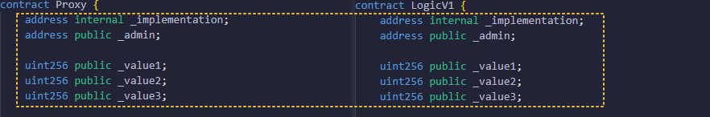

#### 基本理解：
- 在默认机制下，一旦一个合约被部署到链上后，开发者就无法对它进行更改。
- 但是，在传统互联网的理念中，产品大多数时候需要具备迭代特性，即能够"更改"到链上合约。
- 所以，这里引入"代理合约"的概念。
- 传统理念下，只有一个"主体合约(逻辑合约)"，它被部署到链上。
- 代理模式下，仍然是先有"主体合约(逻辑合约)被部署上链"，但，引入一个"中间商合约(代理合约)被部署上链"，用户先连接到的合约是"中间商合约"，然后被"中间商合约"指引到"主体合约"。
- 代理模式的机制引入，就是为了解决合约升级迭代的问题。
- 本节将说明，最基本(也是最粗暴，最简陋)的代理模式。

　

-----------------------------------------------------------------

　

混合代码 - MixContract.sol
```
// SPDX-License-Identifier: MIT
pragma solidity ^0.8.0;

contract Proxy {
    address internal _implementation;
    address public _admin;

    uint256 public _value1;
    uint256 public _value2;
    uint256 public _value3;

    ////////////////////////////////////////////////////

    modifier onlyAdmin() {
        require(msg.sender == _admin);
        _;
    }

    constructor(address logicContractAddress) {
        _admin = msg.sender;
        _implementation = logicContractAddress;
    }

    function upgradeTo(address logicContractAddress) external onlyAdmin {
        require(
            logicContractAddress != _implementation,
            "upgradeTo should not the same!"
        );
        _implementation = logicContractAddress;
    }

    fallback() external payable {
        //_delegate(_implementation);
        _delegate_02(_implementation);
    }

    receive() external payable {}

    // function _delegate(address impl) internal {
    //     (bool suc, bytes memory data) = impl.delegatecall(msg.data);
    //     if (!suc) {
    //         revert("_delegate Failed!");
    //     }
    // }

    function _delegate_02(address impl) internal {
        assembly {
            calldatacopy(0, 0, calldatasize())
            let result := delegatecall(gas(), impl, 0, calldatasize(), 0, 0)
            returndatacopy(0, 0, returndatasize())
            switch result
            case 0 {
                revert(0, returndatasize())
            }
            default {
                return(0, returndatasize())
            }
        }
    }

    /*
        以上 fallback调用 _delegate 与 _delegate_02 的差异

        返回值差异：
        1. 上层的fallback，没有返回值机制，bytes memory data并没有返回出去
        2. 使用汇编的方式，绕开"没有返回值机制"，操作内存做到返回机制。

        可控性与效率差异：
        1. 简洁，语法更易读，但会增加一些 Solidity 自带的错误信息开销。
        2. 直接在内存中处理数据，并确保与被代理的合约返回数据一致，减少额外的开销，提高了效率。
        
        错误信息的传播差异:
        1. 抛出的是自定义的错误 "delegate Failed!"，原始的错误数据不会返回给调用者。
        2. 保留原始合约的返回信息或错误信息，便于调试。

        总结：
        第二种实现方式在高级代理合约中更为常用，因为它可以确保返回数据或错误信息与原始合约一致，且具有更高的效率。
    */
}

contract LogicV1 {
    address internal _implementation;
    address public _admin;

    uint256 public _value1;
    uint256 public _value2;
    uint256 public _value3;

    ////////////////////////////////////////////////////

    event OnSetValue1(uint256 value);
    event OnSetValue2(uint256 value);
    event OnSetValue3(uint256 value);

    //函数选择器，且参数为1，合并编码:  0x6ca0f3210000000000000000000000000000000000000000000000000000000000000001
    function setValue1(uint256 value) external returns (uint256) {
        _value1 = value;
        emit OnSetValue1(value);
        return value;
    }

    //函数选择器，且参数为2，合并编码:  0x74d393f00000000000000000000000000000000000000000000000000000000000000002
    function setValue2(uint256 value) external returns (uint256) {
        _value2 = value;
        emit OnSetValue2(value);
        return value;
    }

    //函数选择器，且参数为3，合并编码:  0x9a68e5820000000000000000000000000000000000000000000000000000000000000003
    function setValue3(uint256 value) external returns (uint256) {
        _value3 = value;
        emit OnSetValue3(value);
        return value;
    }
}
```

　

-----------------------------------------------------------------


　

#### 解释：
- 先部署"逻辑合约"(LogicV1)，再部署"代理合约"(Proxy)
- 代理合约的变量声明，与逻辑合约的变量声明，完全保持一致，这个代表"防止低位插槽冲突"(如果，没有保持一致，那么将发生变量覆盖)。
- 用户调用的传导顺序：用户发起函数调用 -> 代理合约 -> 逻辑合约
- remix上调用示例1：在Proxy面板上，找到low level interactions，填上LogicV1中目标函数的函数选择器合并编码，点击Transact
- remix上调用示例2：先复制Proxy合约的地址，再切换LogicV1合约的面板，在"At Address"按钮右侧的输入框，放入Proxy合约的地址，点击按钮，即可加载出"内核是Proxy合约，但外层马甲是LogicV1的合约"，此时点击面板上的LogicV1的函数，就能发起调用。(等价于示例1)。
- 使用到"fallback机制"，"delegatecall机制"。
- 代理合约的职责：真实的存储合约数据，使用"delegatecall机制"，把调用指令转发的逻辑合约。
- 逻辑合约的职责：虽然定义合约数据，但只是操控变量，变量的原始值隶属于代理合约。
- 为什么我这个测试代码使用一个.sol文件：因为最终调用到逻辑合约函数后，它内部发出了事件，如果是2个合约使用分开的.sol文件编写，remix的控制台logs将无法捕获"事件日志"。


　

