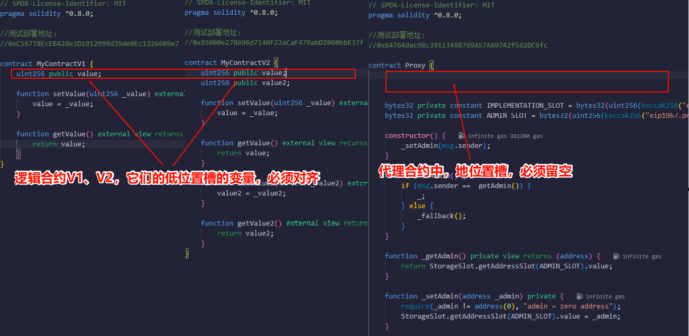

#### 概念：
- 在以太坊虚拟机中，每个存储槽可以存储32字节的数据，这也是 Solidity 中状态变量的基本存储单位。所有变量都按照 32 字节为单位进行存储和分配。

　

-----------------------------------------------------------------

　

#### 示例代码：
```
// SPDX-License-Identifier: MIT
pragma solidity ^0.8.0;

contract Proxy_0 {
    // 显性的低位(默认定义顺序0,1,2...)存储槽的变量

    uint256 public firstVariable; // 槽位 0
    address public secondVariable; // 槽位 1
    bool public thirdVariable; // 槽位 2

    function getValueBySlot(uint256 slotIndex)
        external
        view
        returns (bytes32 value)
    {
        // 读取任意存储槽的值并返回 bytes32 类型的数据
        assembly {
            value := sload(slotIndex)
        }
    }

    function setFristValue(uint256 value) external {
        // 设置0号槽的值
        assembly {
            sstore(0, value)
        }
    }

    function setSecondValue(address value) external {
        // 设置1号槽的值
        assembly {
            sstore(1, value)
        }
    }

    function setThirdValue(bool value) external {
        // 设置2号槽的值
        assembly {
            sstore(2, value)
        }
    }
}

contract Proxy_1 {
    // 表面上不定义低位存储槽的变量

    function getValueBySlot(uint256 slotIndex)
        external
        view
        returns (bytes32 value)
    {
        // 读取任意存储槽的值并返回 bytes32 类型的数据
        assembly {
            value := sload(slotIndex)
        }
    }

    function setFristValue(uint256 value) external {
        // 设置0号槽的值
        assembly {
            sstore(0, value)
        }
    }

    function setSecondValue(address value) external {
        // 设置1号槽的值
        assembly {
            sstore(1, value)
        }
    }

    function setThirdValue(bool value) external {
        // 设置2号槽的值
        assembly {
            sstore(2, value)
        }
    }
}

contract Proxy_2 {
    // 显性的定义了高位(bytes32)存储槽(假如，它们的变量值都是地址类型)

    bytes32 public constant IMPLEMENTATION_SLOT =
        bytes32(uint256(keccak256("eip1967.proxy.implementation")) - 1);
    // 0x360894a13ba1a3210667c828492db98dca3e2076cc3735a920a3ca505d382bbc

    bytes32 public constant ADMIN_SLOT =
        bytes32(uint256(keccak256("eip1967.proxy.admin")) - 1);
    // 0xb53127684a568b3173ae13b9f8a6016e243e63b6e8ee1178d6a717850b5d6103        

    function getValueBySlot_Bytes32(bytes32 slot)
        external
        view
        returns (bytes32)
    {
        // 0x0000000000000000000000000000000000000000000000000000000000000000
        bytes32 value;
        assembly {
            value := sload(slot)
        }
        return value;
    }

    function setHighSlotValue_Address(bytes32 slot, address value) external {
        assembly {
            sstore(slot, value)
        }
    }

    function getHighSlotValue_Address(bytes32 slot)
        external
        view
        returns (address)
    {
        bytes32 value;
        assembly {
            value := sload(slot)
        }
        return address(uint160(uint256(value)));
    }
}

library StorageSlot {
    struct AddressSlot {
        address value;
    }

    function getAddressSlot(bytes32 slot)
        internal
        pure
        returns (AddressSlot storage r)
    {
        assembly {
            r.slot := slot
        }
    }
}

contract Proxy_3 {
    // 显性的定义了高位(bytes32)存储槽(假如，它们的变量值都是地址类型)

    bytes32 public constant IMPLEMENTATION_SLOT =
        bytes32(uint256(keccak256("eip1967.proxy.implementation")) - 1);
    // 0x360894a13ba1a3210667c828492db98dca3e2076cc3735a920a3ca505d382bbc

    bytes32 public constant ADMIN_SLOT =
        bytes32(uint256(keccak256("eip1967.proxy.admin")) - 1);
    // 0xb53127684a568b3173ae13b9f8a6016e243e63b6e8ee1178d6a717850b5d6103        

    function setHighSlotValue_Address(bytes32 slot, address value) external {
        // 使用 StorageSlot库，来写入高位存储槽的值
        StorageSlot.getAddressSlot(slot).value = value;
    }

    function getHighSlotValue_Address(bytes32 slot)
        external
        view
        returns (address)
    {
        // 使用 StorageSlot库，来读取高位存储槽的值
        return StorageSlot.getAddressSlot(slot).value;
    }
}

```

　
#### 其他：
- 如果使用```immutable```声明成员变量，那么该变量会，在部署时存储在合约字节码中，而不是运行时存储（storage）中！！
- 如果使用```constant```声明成员变量，那么该变量会，在编译时就已确定，并直接嵌入到合约的字节码中，而不是存储在运行时存储（storage）中！
- 如果声明```mapping```类型的成员变量，那么该变量不会占用存储槽！
- 如果声明```struct```类型的成员变量，那么该变量会占用存储槽，按照它内部的变量顺序！
　


#### 总结：
- 读取与更改任意指定存储槽的值，不依赖于定义好的变量(即，不定义变量，仍然代表可以操控存储的值)。
- 以上示例，演示了"低位存储的读取、写入"，以及"高位存储的读取、写入"。
- 低位存储槽：普通变量定义，经过哈希计算。(网上的定义大多数不太统一，只能简单理解一下)
- 高位存储槽：通过哈希计算生成的动态唯一值，通常配合使用constant修饰，来避免与槽位冲突。(网上的定义大多数不太统一，只能简单理解一下)
- 低位槽冲突的理解：按顺序查看槽位编号，重叠即冲突。
- 高位槽冲突的理解：哈希唯一值相同，即冲突。
- 标准代理模式下，代理合约只定义"高位存储槽变量"，逻辑合约只定义"低位存储槽变量"。

