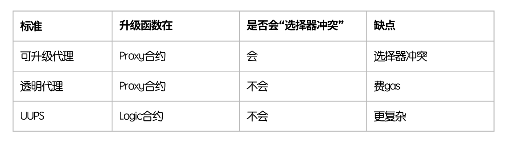

#### 通用可升级代理模式的思想：
- 既然，透明代理模式下，管理员的行为受限
- 此时，让管理员行为不受限，但把"升级函数"放置在"逻辑合约"中，让"代理合约"不定义任何函数。

　

-----------------------------------------------------------------

　

混合代码 - MixContract.sol
```
// SPDX-License-Identifier: MIT
pragma solidity ^0.8.0;

library ERC1967Utils {
    // `IMPLEMENTATION_SLOT` 与 `ADMIN_SLOT` 的统一定义，使用固定的 bytes32 值来定义SLOT，效率非常高，编译时就确定。
    bytes32 internal constant IMPLEMENTATION_SLOT = 0x360894a13ba1a3210667c828492db98dca3e2076cc3735a920a3ca505d382bbc;
    bytes32 internal constant ADMIN_SLOT = 0xb53127684a568b3173ae13b9f8a6016e05a17d6f4eac516e43e4338fbc5fa93c;

    function getImplementation() internal view returns (address) {
        return getAddressSlot(IMPLEMENTATION_SLOT).value;
    }

    function setImplementation(address newImplementation) internal {
        require(newImplementation != address(0), "New implementation is the zero address");
        getAddressSlot(IMPLEMENTATION_SLOT).value = newImplementation;
    }

    function getAdmin() internal view returns (address) {
        return getAddressSlot(ADMIN_SLOT).value;
    }

    function setAdmin(address newAdmin) internal {
        require(newAdmin != address(0), "New admin is the zero address");
        getAddressSlot(ADMIN_SLOT).value = newAdmin;
    }

    struct AddressSlot {
        address value;
    }

    function getAddressSlot(bytes32 slot) internal pure returns (AddressSlot storage r) {
        assembly {
            r.slot := slot
        }
    }
}

contract Proxy {
    // 代理合约中，使用高位存储槽(彻底与逻辑合约的变量定义，隔离开) 记录逻辑合约地址，以及管理员地址，但此处留空，留给 ERC1967Utils来定义。

    ////////////////////////////////////////////////////

    modifier onlyAdmin() {
        require(msg.sender == ERC1967Utils.getAdmin());
        _;
    }

    constructor(address logicContractAddress) {
        ERC1967Utils.setImplementation(logicContractAddress);
        ERC1967Utils.setAdmin(msg.sender);
    }

    function testGetImplementation() public view returns (address) {
        return ERC1967Utils.getImplementation();
    }

    function testGetAdmin() public view returns (address) {
        return ERC1967Utils.getAdmin();
    }    

    fallback() external payable {
        // 不再检查调用者，即不论是管理员还是用户，都可以调用。
        _delegate_02(ERC1967Utils.getImplementation());
    }

    receive() external payable {}

    // function _delegate(address impl) internal {
    //     (bool suc, bytes memory data) = impl.delegatecall(msg.data);
    //     if (!suc) {
    //         revert("_delegate Failed!");
    //     }
    // }

    function _delegate_02(address impl) internal {
        assembly {
            calldatacopy(0, 0, calldatasize())
            let result := delegatecall(gas(), impl, 0, calldatasize(), 0, 0)
            returndatacopy(0, 0, returndatasize())
            switch result
            case 0 {
                revert(0, returndatasize())
            }
            default {
                return(0, returndatasize())
            }
        }
    }

    /*
        以上 fallback调用 _delegate 与 _delegate_02 的差异

        返回值差异：
        1. 上层的fallback，没有返回值机制，bytes memory data并没有返回出去
        2. 使用汇编的方式，绕开"没有返回值机制"，操作内存做到返回机制。

        可控性与效率差异：
        1. 简洁，语法更易读，但会增加一些 Solidity 自带的错误信息开销。
        2. 直接在内存中处理数据，并确保与被代理的合约返回数据一致，减少额外的开销，提高了效率。
        
        错误信息的传播差异:
        1. 抛出的是自定义的错误 "delegate Failed!"，原始的错误数据不会返回给调用者。
        2. 保留原始合约的返回信息或错误信息，便于调试。

        总结：
        第二种实现方式在高级代理合约中更为常用，因为它可以确保返回数据或错误信息与原始合约一致，且具有更高的效率。
    */
}

contract LogicV1 {
    uint256 public _value1;
    uint256 public _value2;
    uint256 public _value3;

    ////////////////////////////////////////////////////

    event OnSetValue1(uint256 value);
    event OnSetValue2(uint256 value);
    event OnSetValue3(uint256 value);

    function upgradeTo(address newImplementation) external {
        // 升级函数，直接定义在逻辑合约中!
        require(msg.sender == ERC1967Utils.getAdmin(), "Caller is not admin");
        ERC1967Utils.setImplementation(newImplementation);
    }    

    //函数选择器，且参数为1，合并编码:  0x6ca0f3210000000000000000000000000000000000000000000000000000000000000001
    function setValue1(uint256 value) external returns (uint256) {
        _value1 = value;
        emit OnSetValue1(value);
        return value;
    }

    //函数选择器:  0x60d586f8000000000000000000000000000000000000000000000000000000000000007b
    function getValue1() external view returns (uint256) {
        return _value1;
    }    

    //函数选择器，且参数为2，合并编码:  0x74d393f00000000000000000000000000000000000000000000000000000000000000002
    function setValue2(uint256 value) external returns (uint256) {
        _value2 = value;
        emit OnSetValue2(value);
        return value;
    }

    //函数选择器:  0xc515205d000000000000000000000000000000000000000000000000000000000000007b
    function getValue2() external view returns (uint256) {
        return _value2;
    }    

    //函数选择器，且参数为3，合并编码:  0x9a68e5820000000000000000000000000000000000000000000000000000000000000003
    function setValue3(uint256 value) external returns (uint256) {
        _value3 = value;
        emit OnSetValue3(value);
        return value;
    }

    //函数选择器:  0xf2d14b00000000000000000000000000000000000000000000000000000000000000007b
    function getValue3() external view returns (uint256) {
        return _value3;
    }    
}

contract LogicV2 is LogicV1 {
    uint256 public _value4;

    ////////////////////////////////////////////////////

    event OnSetValue4(uint256 value);

    //函数选择器，且参数为123，合并编码:  0xd69da761000000000000000000000000000000000000000000000000000000000000007b
    function setValue4(uint256 value) external virtual returns (uint256) {
        _value4 = value;
        emit OnSetValue4(value);
        return value;
    }

    //函数选择器:  0xbfd68858000000000000000000000000000000000000000000000000000000000000007b
    function getValue4() external view returns (uint256) {
        return _value4;
    }      
}

```

　

-----------------------------------------------------------------


　

#### 解释：
- 把"逻辑合约地址槽位、管理员地址槽位"的模块，提炼到```library ERC1967Utils```，这样"逻辑合约"就能轻松访问槽位数据。
- 通用可升级代理模式的缺点：更复杂，因为逻辑合约承载了更多功能。
- 适用：适合资源受限、对升级需求简单的项目，在降低成本的同时提供升级的灵活性。

