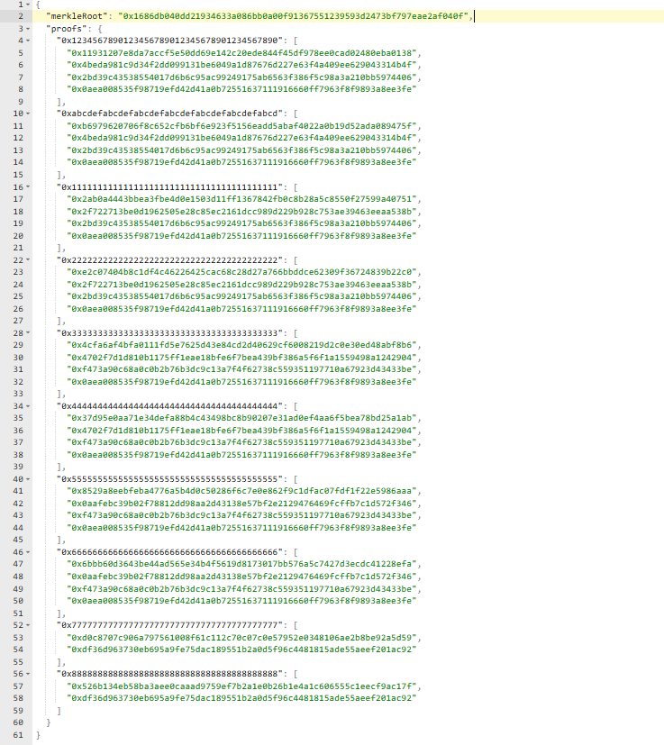
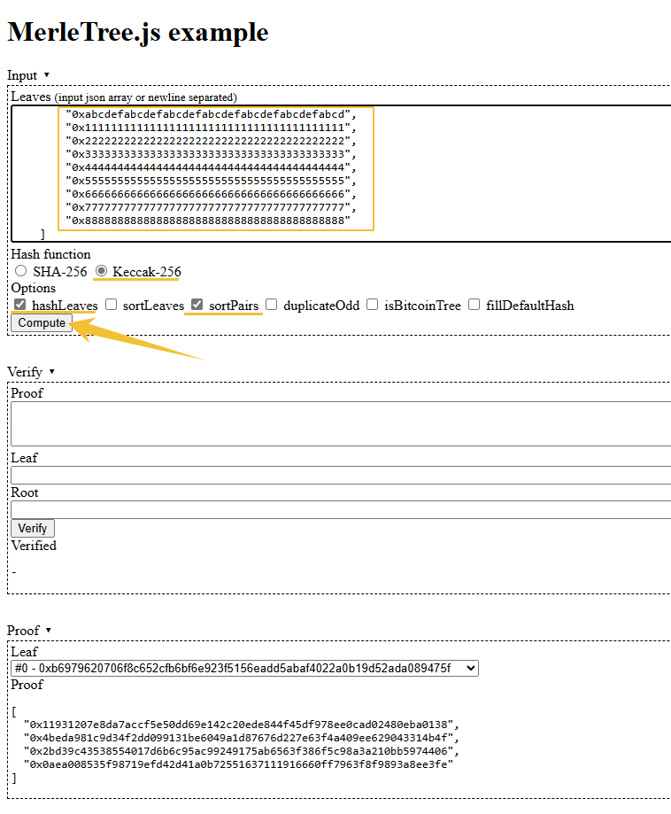
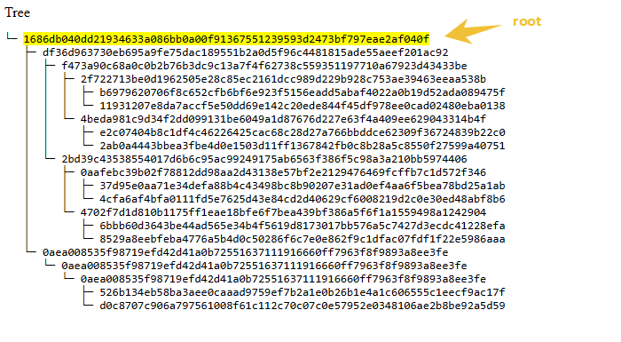

#### 概念：
- 在Solidity中，```Merkle Tree```通常用于验证数据集合中的元素是否存在，尤其在节省存储和减少验证成本的情况下非常有用。
- 它是一种树形结构，其中每个叶节点存储数据的哈希值。
- 非叶节点通过组合其子节点的哈希值计算得出，最终生成一个根哈希值（```Merkle Root```）。
- 给定一个节点的哈希值和一些```Merkle Proof```（其他节点的哈希值），可以验证该节点是否属于此树。
- 可以通过 ```OpenZeppelin``` 提供的 ```MerkleProof``` 库，方便地验证 ```Merkle Proof```。

　

- 以下是一个示例合约，用于验证数据是否在 ```Merkle Tree``` 中。
```
// SPDX-License-Identifier: MIT
pragma solidity ^0.8.0;

import "@openzeppelin/contracts/utils/cryptography/MerkleProof.sol";

contract MerkleTreeExample {
    // Merkle Tree 的根哈希值（Merkle Root）
    bytes32 public merkleRoot;

    // 构造函数，初始化 Merkle Root
    constructor(bytes32 _merkleRoot) {
        merkleRoot = _merkleRoot;
    }

    // 验证函数，检查叶节点是否在 Merkle Tree 中
    function verify(bytes32[] calldata proof, bytes32 leaf) public view returns (bool) {
        // proof 为整个树的数据集
        // leaf 叶子，此处代表 需要被验证的"地址"
        return MerkleProof.verify(proof, merkleRoot, leaf);
    }
}
```

　

- 以下是前端生成整个树，以及部署到链上 的实例
```
const hre = require("hardhat");
const logger = require('../srcs/logger');

const { MerkleTree } = require('merkletreejs');
const keccak256 = require('keccak256');

const { LocalStorage } = require('node-localstorage');

async function main() {

    // 白名单地址（10 个测试地址）
    const whitelistAddresses = [
        "0x1234567890123456789012345678901234567890",
        "0xabcdefabcdefabcdefabcdefabcdefabcdefabcd",
        "0x1111111111111111111111111111111111111111",
        "0x2222222222222222222222222222222222222222",
        "0x3333333333333333333333333333333333333333",
        "0x4444444444444444444444444444444444444444",
        "0x5555555555555555555555555555555555555555",
        "0x6666666666666666666666666666666666666666",
        "0x7777777777777777777777777777777777777777",
        "0x8888888888888888888888888888888888888888"
    ];

    // 生成 Merkle Tree
    const leaves = whitelistAddresses.map(addr => keccak256(addr));
    const tree = new MerkleTree(leaves, keccak256, { sortPairs: true });    

    // Merkle Root
    const merkleRoot = tree.getHexRoot();
    console.log("Merkle Root:", merkleRoot);
    // 0x1686db040dd21934633a086bb0a00f91367551239593d2473bf797eae2af040f

    // 生成每个地址的 Merkle Proof
    const proofs = whitelistAddresses.reduce((acc, addr) => {
        const leaf = keccak256(addr);
        acc[addr] = tree.getHexProof(leaf);
        return acc;
    }, {});    

    // 输出每个地址的 Merkle Proof
    console.log("Merkle Proofs:", proofs);    

    // 将 Merkle Root 和 Proofs 序列化为 JSON 字符串
    const dataToStore = {
        merkleRoot,
        proofs
    };    

    // 创建一个本地存储实例，指定存储目录
    const localStorage = new LocalStorage('./my_files');

    // 将树的根和 Proof 存储到 localStorage
    localStorage.setItem('merkleTree', JSON.stringify(dataToStore));

    const [deployer] = await hre.ethers.getSigners();
    logger.info(`Deploying contracts with the account: ${deployer.address}`);

    const TestMerkleTree = await hre.ethers.getContractFactory("TestMerkleTree", { contractPath: "./contracts/TestMerkleTree.sol" });
    const testMerkleTree = await TestMerkleTree.deploy(merkleRoot);
    await testMerkleTree.deployed();

    logger.info(`TestMerkleTree Contract deployed to: ${testMerkleTree.address}`);
}
```

　

- 以下是生成的默克尔树的json数据



　

- 以下是通过网页形式 https://lab.miguelmota.com/merkletreejs/example/ 生成默克尔树


