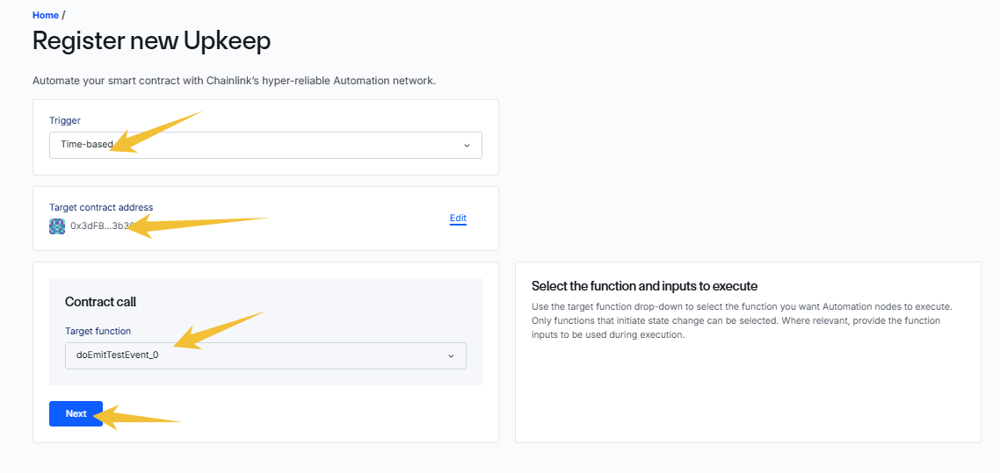

#### 概念：
- 在传统互联网项目中，通常会在项目中，安插"自动化的机制"，即"自己构建一些自动触发机制"，它可以提高程序的效率和可靠性，减少人工干预。
- 在区块链行业中，很多项目是中小型体量，可能不会选择"自己搭建这些机制"，转而选择一些"自动化的工具产品"。
- 常见的自动化工具产品，如，```Chainlink Automation```，```Gelato Network```，```OpenZeppelin Defender```。
- 我这里详细示范一次```Chainlink Automation```。

　

#### 示例```Chainlink Automation```
- 以下是最基础的```Time-Based```方式，即工具会按照设定的频率，向我们的合约发出交互。
- 以下是一个我们的测试合约```TestAutomation_0```，没有任何附带的继承或者使用外部库的关系。
- 自动化工具支持的链，仅限于公开的链(主链，或者主链对应的测试链)，自己搭建的节点是无法支持的(如，Hardhat node)
- 我把它部署在Sepolia链上。
```
// SPDX-License-Identifier: MIT
pragma solidity ^0.8.0;

contract TestAutomation_0 {

    event TestEvent_0(uint256 timestamp);

    function doEmitTestEvent_0() external {
        // 我预期：外部工具每分钟会调用该函数一次
        emit TestEvent_0(block.timestamp);
    }
}
```

- 部署完成后，拿到合约地址，准备使用```Chainlink Automation```的网页进行操作。





　

- 比较常用的```Custom logic```方式，同样工具会按照设定的频率，向我们的合约发出交互，但会加入逻辑函数的判断。
- 合约的差异，见代码如下：
```
// SPDX-License-Identifier: MIT
pragma solidity ^0.8.0;

import "@chainlink/contracts/src/v0.8/automation/AutomationCompatible.sol";

contract TestAutomation_1 is AutomationCompatibleInterface {
    uint public lastTimeStamp;
    uint public interval = 30 seconds;

    event TestEvent_1(uint256 timestamp);

    // 构造函数
    constructor() {
        lastTimeStamp = block.timestamp;
    }    

    // checkUpkeep函数：用于判断是否需要执行定时任务
    function checkUpkeep(bytes calldata /*checkData*/) external view override returns (bool upkeepNeeded, bytes memory) {
        // 在Chainlink Automation 的任务中设置，如 每分钟触发一次，进入到此函数
        upkeepNeeded = (block.timestamp - lastTimeStamp) > interval;
    }

    // performUpkeep函数：执行自动化任务
    function performUpkeep(bytes calldata /*performData*/) external override {
        // 如果"触发的checkUpkeep函数，返回true"，则会进入到此函数，开始执行真实的逻辑
        lastTimeStamp = block.timestamp;
        // 这里可以执行你需要自动化的操作，比如转账、状态更新等
        emit TestEvent_1(block.timestamp);
    }
}
```
- 具体的建立Automation的步骤，就不展开了，切记仍然需要把```Starting Balance```的Link设置为不小于1，才能成功触发自动化。