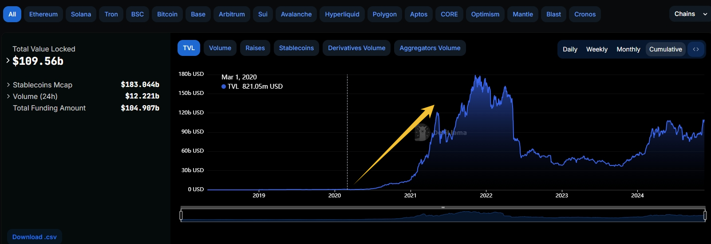
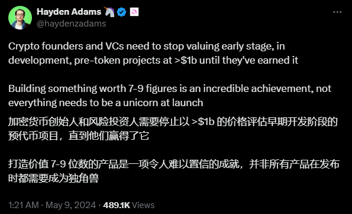
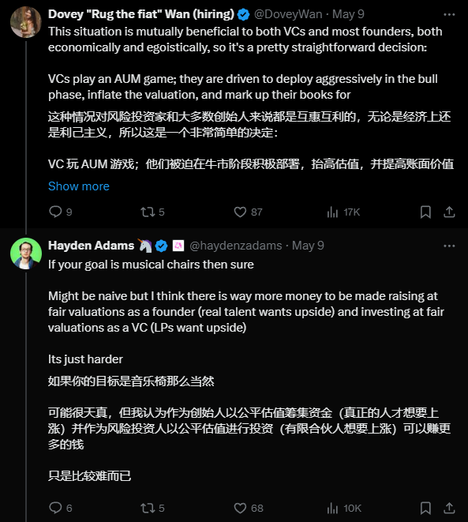

#### 基本信息：
- 创建者：Uniswap团队。
- 发布日期：2020年5月。
- 主要功能：ERC20-ERC20直接互换、FlashSwap(闪贷)、Oracle(预言机)、改进手续费的收取方式。
- 编写语言：Solidity。
- 源码地址：https://github.com/Uniswap/v2-core 与 https://github.com/Uniswap/v2-periphery

　

#### 影响：
- 极大地增加了市场的流动性，使得用户能够更容易地交易非ETH代币对，促进了更多代币的上市和交易。
- 彻底引爆了DeFi赛道。
- DefiLlama 会跟踪多个区块链上的 DeFi 项目，并提供这些项目的 TVL(Total Value Locked 总锁仓价值) 数据。


　

#### 相关故事：
- 2020年8月28日，Sushiswap发布。
- Sushiswap fork 了 Uniswap，并且做了一些改进。
- Sushiswap增加了奖励系统，从Uniswap吸引走许多的流动性。
- 作为回击，2020年9月 Uniswap宣布发行UNI作为治理代币。
- Uniswap的源代码，可能是区块链项目中，被克隆最多的代码。

 

 

 

　

#### 核心合约：
- Uniswap v2-core：
- ```UniswapV2Pair.sol```
- ```UniswapV2Factory.sol```
------------------------------------------------------
- Uniswap v2-periphery：
- ```Router Contract```
- ```Library Contract```