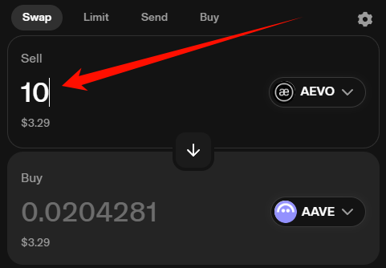

#### 说明一下：
- ```Uniswap v2-periphery```代表计算交易路径(即，简称路由)
- ```Uniswap```详细的满足了2种交易需求的用户：
- 1. 想要确保卖出特定数量资产的人
- 2. 希望确保买入特定数量资产的人
- 以下将列出```Uniswap v2-periphery```中，所有的Swap行为

　

------------------------------------------------------------------------

　

- 输入(或，出售)特定数量的ERC20代币，输出(或，买入)大概数量的ERC20代币：
```
    function swapExactTokensForTokens(
        uint amountIn,
        uint amountOutMin,
        address[] calldata path,
        address to,
        uint deadline
    ) external virtual override ensure(deadline) returns (uint[] memory amounts) {
        amounts = UniswapV2Library.getAmountsOut(factory, amountIn, path);
        require(amounts[amounts.length - 1] >= amountOutMin, 'UniswapV2Router: INSUFFICIENT_OUTPUT_AMOUNT');
        TransferHelper.safeTransferFrom(
            path[0], msg.sender, UniswapV2Library.pairFor(factory, path[0], path[1]), amounts[0]
        );
        _swap(amounts, path, to);
    }
```
- 它对应的操作是界面上：
- 在 出售输入框内，我输入特定数量的ERC20值(即，我精准卖出的值)；
- 在 购买输入框内，系统会自动计算出对应的ERC20值(即，我大概能够兑换得到的值)；
-  
