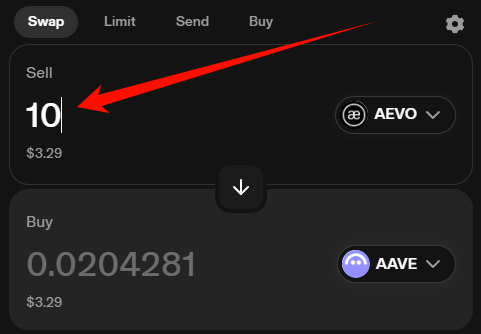
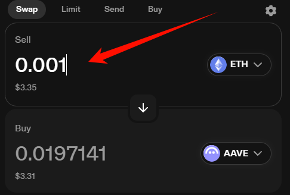
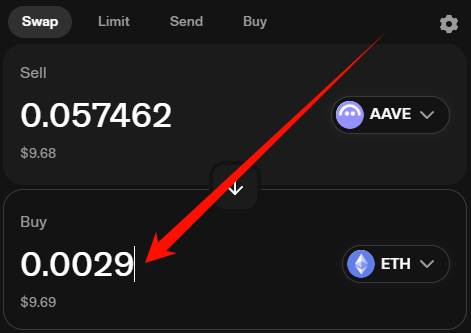
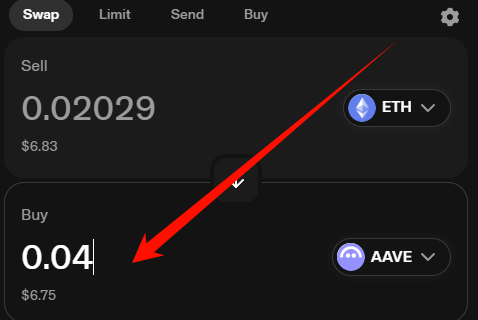

#### 兑换操作：
- ```Uniswap v2-periphery```代表计算交易路径(即，路由)
- ```Uniswap```详细的满足了2种交易需求的用户：
- 1. 想要确保卖出特定数量资产的人
- 2. 希望确保买入特定数量资产的人
- 以下将列出```Uniswap v2-periphery```中，所有的Swap行为

　

------------------------------------------------------------------------

　

- [卖出框]填写[特定数量]的ERC20代币，[买入框]自动估算出[大概数量]的ERC20代币：
```
    function swapExactTokensForTokens(
        uint amountIn,
        uint amountOutMin,
        address[] calldata path,
        address to,
        uint deadline
    ) external virtual override ensure(deadline) returns (uint[] memory amounts) {
        amounts = UniswapV2Library.getAmountsOut(factory, amountIn, path);
        require(amounts[amounts.length - 1] >= amountOutMin, 'UniswapV2Router: INSUFFICIENT_OUTPUT_AMOUNT');
        TransferHelper.safeTransferFrom(
            path[0], msg.sender, UniswapV2Library.pairFor(factory, path[0], path[1]), amounts[0]
        );
        _swap(amounts, path, to);
    }
```
-  

　

------------------------------------------------------------------------

　

- [买入框]填写[特定数量]的ERC20代币，[卖出框]自动估算出[大概数量]的ERC20代币：
```
    function swapTokensForExactTokens(
        uint amountOut,
        uint amountInMax,
        address[] calldata path,
        address to,
        uint deadline
    ) external virtual override ensure(deadline) returns (uint[] memory amounts) {
        amounts = UniswapV2Library.getAmountsIn(factory, amountOut, path);
        require(amounts[0] <= amountInMax, 'UniswapV2Router: EXCESSIVE_INPUT_AMOUNT');
        TransferHelper.safeTransferFrom(
            path[0], msg.sender, UniswapV2Library.pairFor(factory, path[0], path[1]), amounts[0]
        );
        _swap(amounts, path, to);
    }
```
-  

　

------------------------------------------------------------------------

　

- [卖出框]填写[特定数量]的ETH代币，[买入框]自动估算出[大概数量]的ERC20代币：
```
    function swapExactETHForTokens(uint amountOutMin, address[] calldata path, address to, uint deadline)
        external
        virtual
        override
        payable
        ensure(deadline)
        returns (uint[] memory amounts)
    {
        require(path[0] == WETH, 'UniswapV2Router: INVALID_PATH');
        amounts = UniswapV2Library.getAmountsOut(factory, msg.value, path);
        require(amounts[amounts.length - 1] >= amountOutMin, 'UniswapV2Router: INSUFFICIENT_OUTPUT_AMOUNT');
        IWETH(WETH).deposit{value: amounts[0]}();
        assert(IWETH(WETH).transfer(UniswapV2Library.pairFor(factory, path[0], path[1]), amounts[0]));
        _swap(amounts, path, to);
    }
```
-  

　

------------------------------------------------------------------------

　

- [买入框]填写[特定数量]的ETH代币，[卖出框]自动估算出[大概数量]的ERC20代币：
```
    function swapTokensForExactETH(uint amountOut, uint amountInMax, address[] calldata path, address to, uint deadline)
        external
        virtual
        override
        ensure(deadline)
        returns (uint[] memory amounts)
    {
        require(path[path.length - 1] == WETH, 'UniswapV2Router: INVALID_PATH');
        amounts = UniswapV2Library.getAmountsIn(factory, amountOut, path);
        require(amounts[0] <= amountInMax, 'UniswapV2Router: EXCESSIVE_INPUT_AMOUNT');
        TransferHelper.safeTransferFrom(
            path[0], msg.sender, UniswapV2Library.pairFor(factory, path[0], path[1]), amounts[0]
        );
        _swap(amounts, path, address(this));
        IWETH(WETH).withdraw(amounts[amounts.length - 1]);
        TransferHelper.safeTransferETH(to, amounts[amounts.length - 1]);
    }
```
-  

　

------------------------------------------------------------------------

　

- [卖出框]填写[特定数量]的ERC20代币，[买入框]自动估算出[大概数量]的ETH代币：
```
    function swapExactTokensForETH(uint amountIn, uint amountOutMin, address[] calldata path, address to, uint deadline)
        external
        virtual
        override
        ensure(deadline)
        returns (uint[] memory amounts)
    {
        require(path[path.length - 1] == WETH, 'UniswapV2Router: INVALID_PATH');
        amounts = UniswapV2Library.getAmountsOut(factory, amountIn, path);
        require(amounts[amounts.length - 1] >= amountOutMin, 'UniswapV2Router: INSUFFICIENT_OUTPUT_AMOUNT');
        TransferHelper.safeTransferFrom(
            path[0], msg.sender, UniswapV2Library.pairFor(factory, path[0], path[1]), amounts[0]
        );
        _swap(amounts, path, address(this));
        IWETH(WETH).withdraw(amounts[amounts.length - 1]);
        TransferHelper.safeTransferETH(to, amounts[amounts.length - 1]);
    }
```
-  

　

------------------------------------------------------------------------

　

- [买入框]填写[特定数量]的ERC20代币，[卖出框]自动估算出[大概数量]的ETH代币：
```
    function swapETHForExactTokens(uint amountOut, address[] calldata path, address to, uint deadline)
        external
        virtual
        override
        payable
        ensure(deadline)
        returns (uint[] memory amounts)
    {
        require(path[0] == WETH, 'UniswapV2Router: INVALID_PATH');
        amounts = UniswapV2Library.getAmountsIn(factory, amountOut, path);
        require(amounts[0] <= msg.value, 'UniswapV2Router: EXCESSIVE_INPUT_AMOUNT');
        IWETH(WETH).deposit{value: amounts[0]}();
        assert(IWETH(WETH).transfer(UniswapV2Library.pairFor(factory, path[0], path[1]), amounts[0]));
        _swap(amounts, path, to);
        // refund dust eth, if any
        if (msg.value > amounts[0]) TransferHelper.safeTransferETH(msg.sender, msg.value - amounts[0]);
    }
```
-  

　

------------------------------------------------------------------------

　

- ```SupportingFeeOnTransferTokens```代指：转账过程中会自动扣除费用的代币。
- 有些代币在进行转账时会自动扣除一部分费用。这些费用通常用于支付给持有这些代币的人（类似于股息）、项目开发团队、营销活动等。
- 这种机制被称为“反射费”（reflection fee）或“转账费”（transfer fee）。
- 这里不去讨论哪些代币，有这些特征。
- 以下将列出```SupportingFeeOnTransferTokens```相关的3个Swap行为(它们都是卖出数量为特定，才能进行计算)：

　

- [卖出框]填写[特定数量]的ERC20代币，[买入框]自动估算出[大概数量]的ERC20代币：
```
    function swapExactTokensForTokensSupportingFeeOnTransferTokens(
        uint amountIn,
        uint amountOutMin,
        address[] calldata path,
        address to,
        uint deadline
    ) external virtual override ensure(deadline) {
        TransferHelper.safeTransferFrom(
            path[0], msg.sender, UniswapV2Library.pairFor(factory, path[0], path[1]), amountIn
        );
        uint balanceBefore = IERC20(path[path.length - 1]).balanceOf(to);
        _swapSupportingFeeOnTransferTokens(path, to);
        require(
            IERC20(path[path.length - 1]).balanceOf(to).sub(balanceBefore) >= amountOutMin,
            'UniswapV2Router: INSUFFICIENT_OUTPUT_AMOUNT'
        );
    }
```
-  

　

------------------------------------------------------------------------

　

- [卖出框]填写[特定数量]的ETH代币，[买入框]自动估算出[大概数量]的ERC20代币：
```
    function swapExactETHForTokensSupportingFeeOnTransferTokens(
        uint amountOutMin,
        address[] calldata path,
        address to,
        uint deadline
    )
        external
        virtual
        override
        payable
        ensure(deadline)
    {
        require(path[0] == WETH, 'UniswapV2Router: INVALID_PATH');
        uint amountIn = msg.value;
        IWETH(WETH).deposit{value: amountIn}();
        assert(IWETH(WETH).transfer(UniswapV2Library.pairFor(factory, path[0], path[1]), amountIn));
        uint balanceBefore = IERC20(path[path.length - 1]).balanceOf(to);
        _swapSupportingFeeOnTransferTokens(path, to);
        require(
            IERC20(path[path.length - 1]).balanceOf(to).sub(balanceBefore) >= amountOutMin,
            'UniswapV2Router: INSUFFICIENT_OUTPUT_AMOUNT'
        );
    }
```
-  

　

------------------------------------------------------------------------

　

- [卖出框]填写[特定数量]的ERC20代币，[买入框]自动估算出[大概数量]的ETH代币：
```
    function swapExactTokensForETHSupportingFeeOnTransferTokens(
        uint amountIn,
        uint amountOutMin,
        address[] calldata path,
        address to,
        uint deadline
    )
        external
        virtual
        override
        ensure(deadline)
    {
        require(path[path.length - 1] == WETH, 'UniswapV2Router: INVALID_PATH');
        TransferHelper.safeTransferFrom(
            path[0], msg.sender, UniswapV2Library.pairFor(factory, path[0], path[1]), amountIn
        );
        _swapSupportingFeeOnTransferTokens(path, address(this));
        uint amountOut = IERC20(WETH).balanceOf(address(this));
        require(amountOut >= amountOutMin, 'UniswapV2Router: INSUFFICIENT_OUTPUT_AMOUNT');
        IWETH(WETH).withdraw(amountOut);
        TransferHelper.safeTransferETH(to, amountOut);
    }
```
-  

　

------------------------------------------------------------------------

　

#### 添加流动性操作：
- 1.用户选定好代币配对。
- 2.填写放入的代币数量。
- 3.确认[最大滑点]，也就是，价格波动的最大容忍值。(如果超过，则交易回滚)
- 4.确认[最大交易时长]，也就是，交易的最大耗时值。(如果超过，则交易回滚)
-   