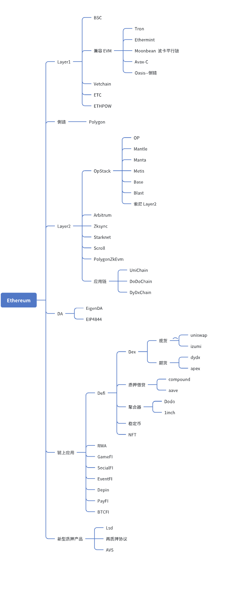

### 浅析一下用户发出交易的过程：

#### 交易创建
```
用户操作：
    用户（例如张三）使用以太坊钱包（如 MetaMask）创建一笔交易。
    交易内容包括：
        接收地址：目标地址（例如李四的以太坊地址）。
        转账金额：要发送的以太币数量（例如 1 ETH）。
        Gas Limit：用户愿意为交易支付的最大 Gas 数量。
        Gas Price：用户愿意为每单位 Gas 支付的价格（以 Gwei 为单位）。
        数据字段（可选）：如果交易涉及智能合约调用，数据字段会包含调用合约函数的编码数据。
签名：
    用户使用私钥对交易进行签名，以证明交易是由地址的所有者发起的。
```

#### 交易广播
```
用户操作：
    用户的钱包软件将签名后的交易广播到以太坊网络。

传播过程：
    交易被发送到连接的以太坊节点（通常是全节点或轻节点）。
    节点使用洪水算法（Flooding Algorithm）将交易广播给其连接的邻居节点。
    交易逐渐传播到整个以太坊网络。
```

#### 交易验证
```
全节点的工作：
    每个接收到交易的以太坊全节点会对交易进行验证：
        验证签名：确认交易是由发送者地址的私钥签名的。
        检查账户余额：确认发送者地址有足够的以太币支付转账金额和 Gas 费用。
        检查 Nonce：确认交易的 Nonce 值与发送者地址的当前 Nonce 匹配（防止重放攻击）。
        检查 Gas Limit 和 Gas Price：确认 Gas Limit 和 Gas Price 符合网络规则。
    如果交易有效，节点会将其放入本地内存池（mempool），等待验证者打包。
```

#### 挖矿
```
验证者的工作：
    验证者从内存池中收集交易，并尝试将其打包进新区块。
    交易选择：
        验证者优先选择 Gas Price 较高的交易，以最大化收益。
        验证者还会考虑交易的 Gas Limit，确保区块的 Gas 总量不超过区块 Gas 上限（目前约为 3000 万 Gas）。
    创建候选区块：
        验证者将选中的交易打包成一个候选区块。
        区块中包含区块头（包含前一个区块的哈希、时间戳、Nonce 等）和交易列表。
    工作量证明（PoW）或权益证明（PoS）：
        在以太坊 2.0 之前，矿工通过 PoW 机制计算区块头的哈希值，直到找到满足难度目标的 Nonce。
            暂且认为与BTC类似于吧(毕竟不是做公链的，先不了解深)
            Ghost协议：不仅考虑最长链上的区块，还考虑被丢弃的分支（子树）中的区块。
            Greedy Heaviest Observed Subtree：贪婪最重观察子树。
            叔叔区块：分叉区块，仍可获得大部分区块奖励。
            ForkingAttack：分叉后的第一个区块，才能获取奖励(作为叔叔区块)。
        在以太坊 2.0 之后，矿工被验证者取代，验证者通过 PoS 机制提议和验证新区块。
            验证者：质押32个ETH的用户，同时运行以太坊全节点客户端。
            区块提议：每个 epoch（约 6.4 分钟，包含 32 个 slot）中，系统随机选择一个验证者作为区块提议者，负责打包交易(Gas Price 从高到低)并生成新区块。
            区块验证：每个 slot（12 秒）中，系统随机选择一个委员会（Committee，大约为128个验证者）来验证区块。
            通过 RANDAO 和 VDF 的结合，实现了去中心化、抗操纵且一致的随机数生成机制。
            所有客户端基于相同的算法和输入，能够计算出相同的随机数，从而确保网络中的随机操作（如选择区块提议者和验证者委员会）在所有节点中保持一致。
            共识机制：使用 Casper FFG（Friendly Finality Gadget） 和 LMD-GHOST（Latest Message Driven Greediest Heaviest Observed Subtree） 作为共识算法。            
```

#### 区块广播
```
矿工/验证者的操作：
    成功挖出新区块的矿工（或验证者）将区块广播到以太坊网络。
传播过程：
    区块被传播到所有以太坊全节点。
    节点使用洪水算法将区块广播给其邻居节点，直到区块传播到整个网络。
```

#### 区块验证
```
全节点的工作：
    每个接收到新区块的全节点会对区块进行验证：
        验证区块头：检查区块头的哈希值是否满足难度目标（PoW）或签名是否有效（PoS）。
        验证交易：检查区块中的所有交易是否有效（包括签名、Nonce、余额等）。
        检查状态转换：执行区块中的所有交易，更新以太坊的状态（账户余额、合约状态等）。
        检查链上链接：确认新区块正确链接到前一个区块。
    如果区块有效，节点会将其添加到本地的区块链中，并继续广播给其他节点。

出块时间(面试题)：
    ETH1.0：约13到15秒。
    ETC：约13秒。
    ETH2.0：约12秒。

交易确认位(面试题)：
    ETH1.0：通常需要12个区块，大约3分钟。
    ETC：通常需要120个区块，大约26分钟。
    ETH2.0：通常需要32-64个区块，大约6-12分钟。

Finalized所需区块数:
    ETH1.0：通常需要12个区块，大约3分钟。
    ETC：通常需要120个区块，大约26分钟。
    ETH2.0：通常需要64个区块，大约12分钟。
```

#### 交易确认
```
区块链更新：
    张三转账给李四的交易被包含在新区块中，并写入以太坊区块链。
    这笔交易现在被认为是已确认的交易。
状态更新：
    以太坊的状态（全局状态树）会更新：
        张三的账户余额减少（扣除转账金额和 Gas 费用）。
        李四的账户余额增加（增加转账金额）。
        如果交易涉及智能合约调用，合约的状态也会相应更新。        
```

#### 奖励分配
```
验证者的奖励：
    区块奖励：验证者获得新生成的以太币作为区块奖励(当前约为 2 ETH)。
    Gas 费用：验证者获得交易中累积支付的 Gas 费用。
    叔块奖励（PoW）：在以太坊 PoW 机制中，矿工还可能获得叔块奖励（如果他们的区块未被包含在主链中，但被后续区块引用）。
```

　

---------------------------------------------------------------------------------

　


### 其他与思考：
```
    以太坊中的nonce，直译为"交易次数"。

    以太币是基于账户，才能顺利构建智能合约，每一个参与者是相对稳定的身份。

    天然防范"双花攻击(花钱的人，不诚实)"，但带来了"重放攻击(收钱的人，不诚实)"

    防止"重放攻击"，是使用的nonce参与交易签名，故无法实施攻击。
```



　

---------------------------------------------------------------------------------

　


#### 以太币的单位：
```
Wei(最小的计量单位)
Kwei(Babbage) = 10^3  Wei           // Charles Babbage 他是早期计算机设计的先驱之一。
Mwei(Lovelace) = 10^6 Wei           // Ada Lovelace 她被认为是世界上第一位程序员。
Gwei(Shannon) = 10^9 Wei            // Claude Shannon 他是信息论的创始人。
Microether(Szabo) = 10^12 Wei       // Nick Szabo 他是一位计算机科学家、法律学者和密码学家，也因为智能合约的概念而闻名。
Milliether(Finney) = 10^15 Wei      // Hal Finney 他是比特币的早期采用者和支持者，也是密码学领域的重要人物。
Ether = 10^18 Wei

记忆方式：看门狗(K - M - G)，哈哈哈
```