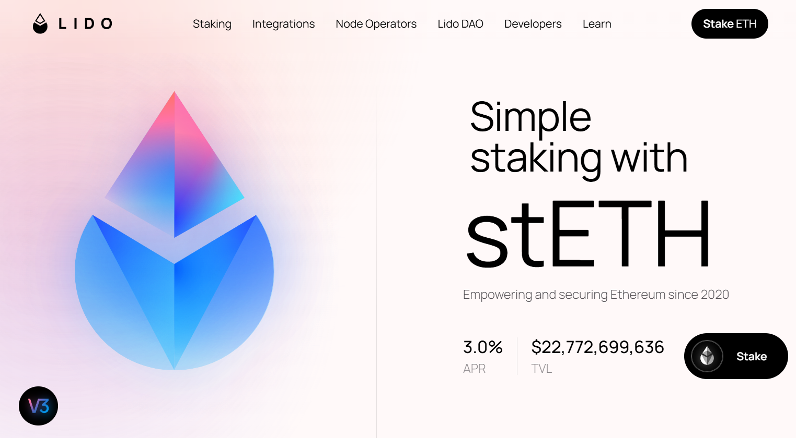
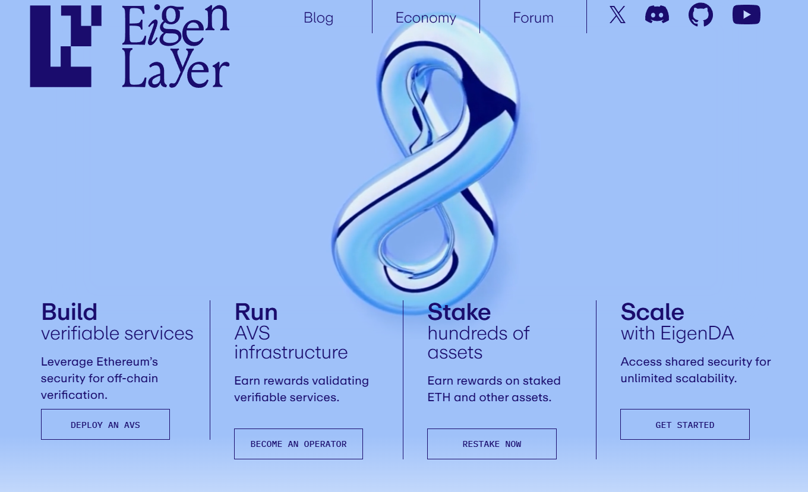
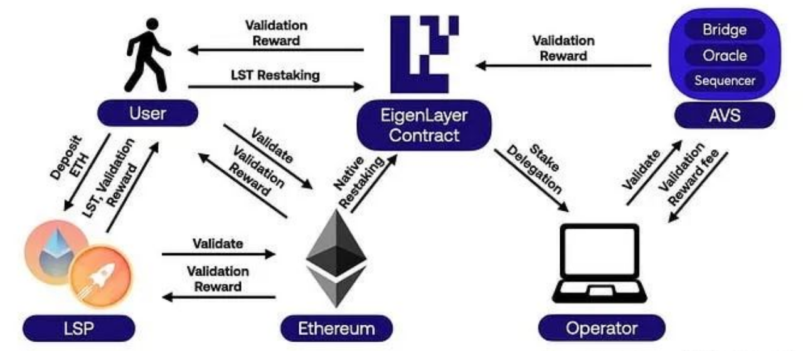
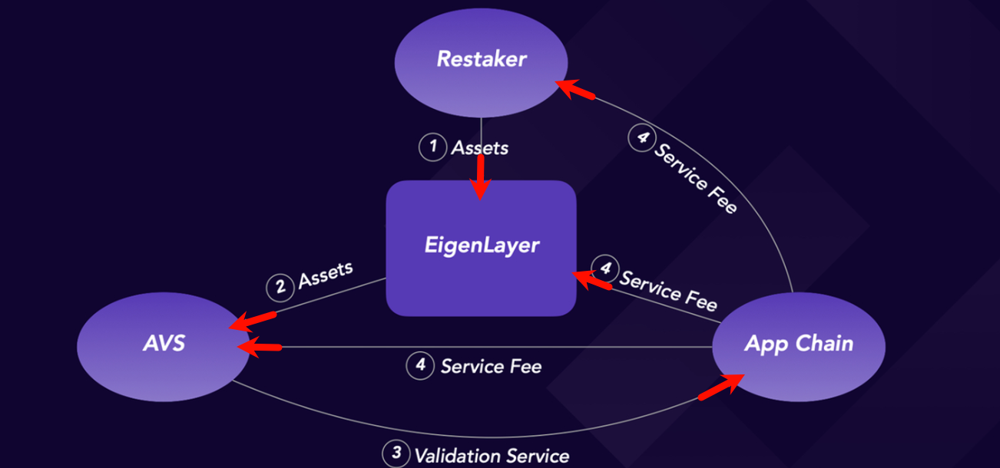

### ```EigenLayer```业务流程简短描述(先睹为快)
- 用户在 ```EigenLayer``` 上质押 ```LSD``` 资产。
- 质押的资产提供给```AVS```进行安全保护。
- ```AVS```为应用链提供网络节点验证服务。
- 应用链（```如 Layer 2 Rollups，例如 Arbitrum Orbit、Optimism 的 OP Stack、Mantle Network 等```）支付服务费，分为三部分，
  - 分别作为"质押奖励"、"服务收入" 和 "协议收入" 。
    - 质押奖励：支付给 ```Stakers```（质押 ```LSD``` 如 ```stETH``` 的用户）。
    - 服务收入：支付给 ```Operators```（运行 ```AVS``` 节点的实体）。
    - 协议收入：支付给 ```EigenLayer```（协议开发者或 ```DAO```）。
  - 详见下方"商业模型图"。

### ```EigenLayer```使用流程详细示例
```
🔵 存入流程：
    [你的钱包] (1 ETH)
    │
    ▼
    1️⃣ 存入Lido质押合约
    ├─ 操作：发送1 ETH → Lido智能合约
    ├─ 获得：1 stETH（实时生息代币）
    └─ 即时开始赚取：Lido基础质押收益 ( ≈ 3% APR)
    │
    ▼
    2️⃣ 质押至EigenLayer主合约
    ├─ 操作：质押1 stETH → EigenLayer核心合约
    ├─ 获得：EigenLayer质押凭证
    └─ 新增收益：EigenLayer基础再质押奖励 ( ≈ 2-4% APR)
    │
    ▼
    3️⃣ 选择并委托AVS（以EigenDA为例）
    ├─ 操作：授权EigenLayer将质押权益委托给EigenDA
    ├─ 获得：EigenDA积分（按小时累积）
    └─ 新增收益：AVS专项奖励（未来代币空投）


🔴 赎回流程（30天后）：
    [质押头寸] (1 ETH本金 + 三层收益)
     │
     ▼
    1️⃣ 从AVS解除委托 (1-3天处理期)
       ├─ 操作：取消EigenDA委托 → 释放质押权益
       ├─ 结算：获得EigenDA积分（30天累积量）
       └─ 期间仍赚取：Lido + EigenLayer基础收益 ≈ 0.00015 ETH/天          
     │
     ▼
    2️⃣ 从EigenLayer解绑 (7天等待期)
       ├─ 操作：请求取回1 stETH + EigenLayer收益
       ├─ 到账：1.0015 stETH（含30天EigenLayer收益）
       └─ 解绑期间仍赚取：Lido收益 ≈ 0.00008 ETH/天          
     │
     ▼
    3️⃣ 从Lido赎回ETH (1-3天处理期)
       ├─ 操作：提交1.0025 stETH → Lido赎回队列
       ├─ 结算：获得1.004 ETH（含30天总收益）
       └─ 明细：
           • 本金：1 ETH
           • Lido收益：0.0025 ETH
           • EigenLayer收益：0.0015 ETH
           • AVS积分：待未来兑换
     │
     ▼
    [最终到账] 1.004 ETH + AVS积分权益
```

### 名词浅析 - ```Lido```
- 名称由来：```Liquidity Interest Distribution Organization```或```Liquid Staking for Decentralized Finance```
- 协议：```Lido```是一个去中心化的流动性质押协议，它是一个运行在以太坊及其他区块链上的协议。
- 宗旨：旨在为用户提供一种将原生加密资产（如 ```ETH```）质押到 ```PoS```（权益证明）网络中并同时保持流动性的解决方案。
- 官网：https://lido.fi/
- 

### 名词浅析 - ```EigenLayer```
- 名称由来：```EigenLayer``` 的创始人 ```Sreeram Kannan```（华盛顿大学副教授）曾提到，名称的选择反映了协议的目标：
- 名称由来：“我们希望以太坊的安全性成为其他协议的基础特征（```Eigen```），而 ```EigenLayer``` 是实现这一目标的中间层（```Layer```）。”
- 名称用意总结：```EigenLayer``` 的名称 = ```Eigen```（核心特征） + ```Layer```（协议层），完整诠释了其通过"重新质押"将 ```ETH``` 安全性“泛化”到整个生态的愿景。
- 协议：```EigenLayer``` 是一种基于以太坊的重新质押（```restaking```）协议。
- 宗旨：允许用户通过将其已质押的以太坊（```ETH```）或流动性质押代币（```LSTs```）重新分配到其他协议或服务（称为主动验证服务，```AVSs```）来增强以太坊生态系统的安全性和效率，同时赚取额外收益。
- 叙事：```EigenLayer```可以被视为 ```LSD(Liquid Staking Derivative)``` 生态的佼佼者，因为它通过创新的重新质押机制和 ```AVS（如 EigenDA）```显著增强了 ```LSD``` 代币（如 ```stETH```）的收益和应用场景。
- 叙事：```EigenLayer``` 在"重新质押"和"共享安全"领域处于领先地位。
- 官网：https://www.eigenlayer.xyz/
- 

### 名词浅析 - ```EigenDA```
- 名称由来：全称是 ```Eigen Data Availability```。
- 名称由来：“```DA```”代表“```Data Availability```”，指，数据可用性（即，确保区块链网络中的交易数据可被所有节点访问和验证）。
- 协议：```EigenDA```是一个构建在 ```EigenLayer``` 上的数据可用性协议。
- 宗旨：专注于为以太坊 ```Layer 2 Rollups``` 提供高吞吐量、低成本、去中心化的数据存储和验证服务。

### 名词浅析 - ```AVS```
- 名称由来：全称是 ```Actively Validated Service```（主动验证服务）。
- 组件：```AVS```是 ```EigenLayer``` 生态系统中的一种核心组件，允许开发者构建依赖以太坊质押资产（通过重新质押机制）进行安全验证的去中心化服务。
- 基础设施：```AVS```是```EigenLayer``` 提供的一种模块化基础设施，允许各种区块链服务（如数据可用性、预言机、桥接、排序等）利用以太坊的质押经济安全性，而无需为每种服务单独建立验证者网络。

### 名词浅析 - ```Operator```
- 定义：```Operator```（操作者） 是指参与 ```EigenLayer``` 生态系统中的节点运营者，负责运行验证节点以支持 主动验证服务（```AVS```），例如 ```EigenDA```。
- 定义：```Operator``` 是运行区块链验证节点（```validator nodes```）的实体，负责执行与 ```AVS``` 相关的计算和验证任务。

### ```EigenLayer```关系图
- 

### ```EigenLayer```商业模型图
- 
